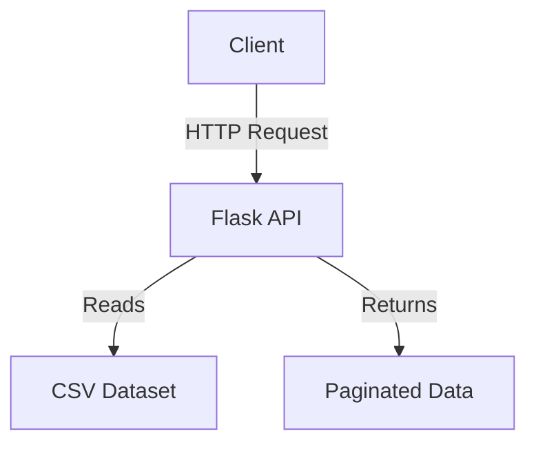
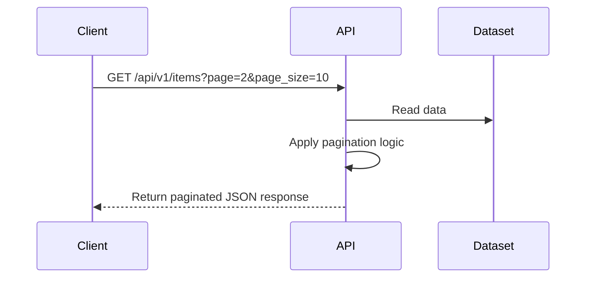

# 1. Project Overview
**Purpose:** Introduce and implement server-side pagination for web APIs, enabling efficient data retrieval and navigation for large datasets.

**Scope:** This project covers the design and implementation of paginated API endpoints using Python and Flask. It demonstrates best practices for handling large datasets in web applications.

**Key Features:**
- Paginated API endpoints
- Parameter validation and error handling
- Example dataset and test suite

---

# 2. System Architecture
**Architecture Diagram:**

**Description:**
- The client sends HTTP requests to the Flask API, specifying pagination parameters (page, page_size).
- The API reads from a CSV dataset, applies pagination logic, and returns the appropriate data slice as a JSON response.

---

# 3. Component Details
- **API Layer (server.py):**
  - *Purpose:* Expose paginated endpoints and handle requests.
  - *Key Technologies:* Python, Flask
  - *Responsibilities:* Parse parameters, validate input, return paginated data.
  - *Interactions:* Communicates with the dataset and returns JSON responses to clients.
- **Dataset (dataset.csv):**
  - *Purpose:* Provide sample data for pagination.
  - *Key Technologies:* CSV
  - *Responsibilities:* Store and supply data to the API.
- **Tests (tests/):**
  - *Purpose:* Validate pagination logic and API correctness.
  - *Key Technologies:* unittest
  - *Responsibilities:* Automated testing of endpoints and edge cases.

---

# 4. Data Models / Schema
- **Entity-Relationship Diagram:** N/A (Flat CSV data)
- **Key Entities:** Each row in the CSV represents a data item (e.g., record, entry).
- **Relationships:** N/A

---

# 5. Data Flow
**Flow Diagram:**

**Description:**
1. Client requests a specific page of data.
2. API reads the dataset and applies pagination.
3. API returns the requested data slice as JSON.

---

# 6. Deployment & Environment
- **Deployment Process:**
  1. Install dependencies from `requirements.txt`.
  2. Run `python server.py` to start the Flask server.
- **Environments:** Local development (default), can be adapted for production.
- **Configuration:**
  - Environment variables: N/A (default config)
  - Dataset file: `dataset.csv`

---

# 7. Security Considerations
- **Authentication/Authorization:** N/A (demo project, no auth)
- **Data Protection:** No sensitive data; demo dataset only.
- **Other:** Validate all input parameters to prevent abuse.

---

# 8. Error Handling & Resilience
- **Error Handling Strategy:**
  - Return clear error messages for invalid parameters (e.g., out-of-range page).
  - Handle missing or malformed requests gracefully.
- **Resilience:**
  - Handles empty datasets and edge cases without crashing.

---

# 9. Design Decisions & Trade-offs
- **Key Decisions:**
  - Use of CSV for simplicity and demonstration purposes.
  - Stateless API design for scalability.
- **Alternatives Considered:**
  - Using a database for persistent storage (not needed for demo).
- **Limitations:**
  - Not suitable for very large datasets or production use without optimization.

---

# 10. Glossary
- **Pagination:** Dividing a dataset into discrete pages for easier navigation.
- **Endpoint:** A specific API route that clients can access.
- **Page/Size Parameters:** Query parameters controlling which data slice is returned.

---

# 11. Further Reading & References
- [Flask Documentation](https://flask.palletsprojects.com/)
- [Pagination Concepts](https://en.wikipedia.org/wiki/Pagination)
- [ALX Backend Curriculum](https://www.alxafrica.com/software-engineering/)

---

