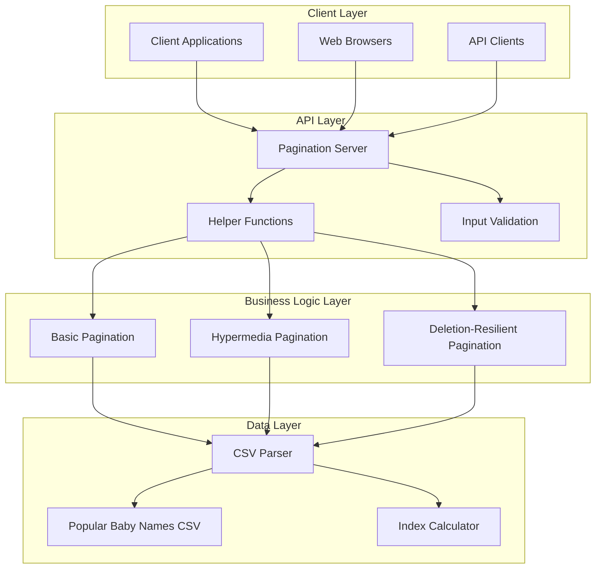
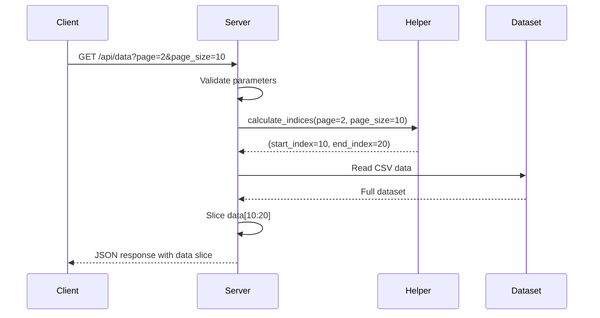
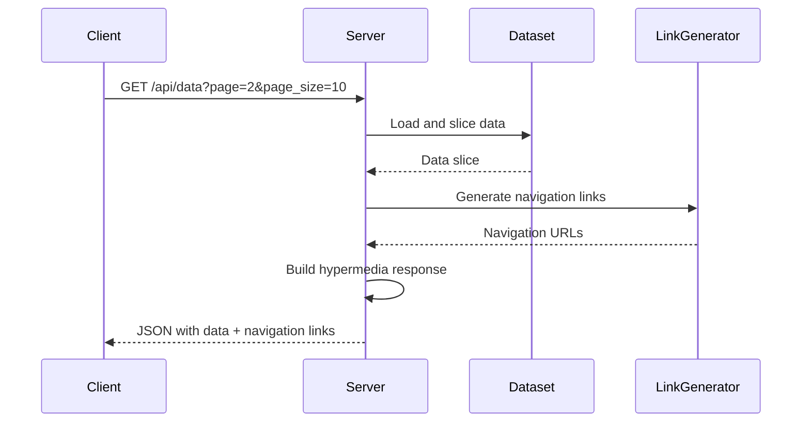
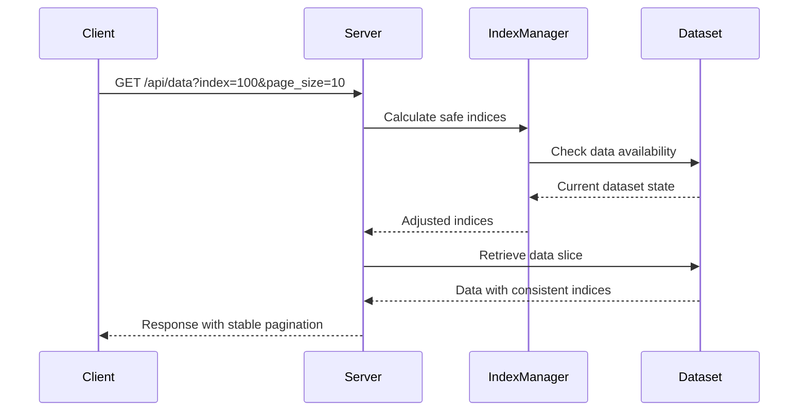
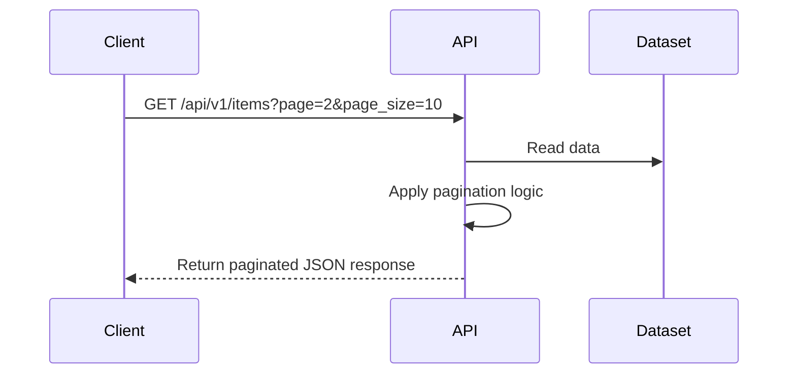

# Architecture Overview - 0x00 Pagination

## 1. Project Overview

**Purpose**: Implement comprehensive server-side pagination strategies for web APIs, enabling efficient data retrieval and navigation for large datasets while maintaining optimal performance and user experience.

**Scope**: This project covers the design and implementation of multiple pagination approaches including basic pagination, hypermedia-driven pagination (HATEOAS), and deletion-resilient pagination systems using Python and Flask framework.

**Key Features**:
- Mathematical pagination index calculation
- RESTful paginated API endpoints with proper HTTP semantics
- Hypermedia-driven API responses with navigation links
- Deletion-resilient pagination for dynamic datasets
- Comprehensive parameter validation and error handling
- Real-world dataset integration with CSV processing

## 2. System Architecture

### Architecture Diagram


**Description**: The system implements a layered architecture where clients interact with a Flask-based pagination server that provides multiple pagination strategies. Each strategy handles data retrieval differently while maintaining consistent API interfaces and optimal performance characteristics.

## 3. Component Details

### Helper Functions Module (`0-simple_helper_function.py`)
- **Purpose**: Provide mathematical foundation for pagination calculations
- **Key Technologies**: Python, mathematical algorithms
- **Responsibilities**:
  - Calculate start and end indices for given page and page size
  - Handle boundary conditions and edge cases
  - Provide reusable pagination mathematics
- **Interactions**: Used by all pagination implementations as foundation

### Basic Pagination Server (`1-simple_pagination.py`)
- **Purpose**: Implement core pagination functionality with parameter validation
- **Key Technologies**: Python, CSV processing, object-oriented design
- **Responsibilities**:
  - Load and cache dataset in memory
  - Validate page and page_size parameters
  - Return appropriate data slices for requested pages
  - Handle out-of-range requests gracefully
- **Interactions**: Inherits from base server class, uses helper functions

### Hypermedia Pagination (`2-hypermedia_pagination.py`)
- **Purpose**: Implement HATEOAS-compliant pagination with navigation metadata
- **Key Technologies**: Python, REST API design, hypermedia principles
- **Responsibilities**:
  - Generate navigation links (next, prev, first, last)
  - Include pagination metadata in responses
  - Provide self-describing API responses
  - Enable stateless client navigation
- **Interactions**: Extends basic pagination with hypermedia features

### Deletion-Resilient Pagination (`3-hypermedia_del_pagination.py`)
- **Purpose**: Handle pagination consistency when underlying data changes
- **Key Technologies**: Python, advanced pagination algorithms, state management
- **Responsibilities**:
  - Maintain stable pagination indices during data modifications
  - Handle item deletions between pagination requests
  - Provide consistent user experience with dynamic datasets
  - Implement advanced indexing strategies
- **Interactions**: Most sophisticated implementation, handles complex edge cases

## 4. Data Models / Schema

### Pagination Request Schema
```python
PaginationRequest = {
    "page": int,           # Page number (1-based indexing)
    "page_size": int,      # Number of items per page
    "index": int           # Optional: starting index for deletion-resilient pagination
}
```

### Basic Pagination Response
```python
BasicPaginationResponse = {
    "data": List[Dict],    # Array of data items for current page
    "total_items": int,    # Total number of items in dataset
    "current_page": int,   # Current page number
    "items_per_page": int  # Number of items per page
}
```

### Hypermedia Pagination Response
```python
HypermediaPaginationResponse = {
    "data": List[Dict],           # Array of data items
    "page": int,                  # Current page number
    "page_size": int,             # Items per page
    "total_pages": int,           # Total number of pages
    "next_url": Optional[str],    # URL for next page
    "prev_url": Optional[str],    # URL for previous page
    "first_url": str,             # URL for first page
    "last_url": str              # URL for last page
}
```

### Dataset Schema (Popular_Baby_Names.csv)
```python
BabyNameRecord = {
    "Year of Birth": str,    # Birth year
    "Gender": str,           # M/F
    "Ethnicity": str,        # Ethnic classification
    "Child's First Name": str, # Given name
    "Count": int,            # Frequency count
    "Rank": int              # Popularity rank
}
```

## 5. Data Flow

### Basic Pagination Flow


### Hypermedia Pagination Flow


### Deletion-Resilient Flow


## 6. Deployment & Environment

### Development Setup
```bash
# Prerequisites
python3 --version  # Ensure Python 3.7+
pip install flask  # If using Flask server (optional)

# Project setup
cd 0x00-pagination
python3 0-main.py   # Test helper function
python3 1-main.py   # Test basic pagination
python3 2-main.py   # Test hypermedia pagination
python3 3-main.py   # Test deletion-resilient pagination
```

### Testing Environment
```bash
# Run all test scripts
for test in *-main.py; do
    echo "Running $test..."
    python3 "$test"
    echo "---"
done
```

### Production Considerations
```bash
# Flask deployment example
export FLASK_APP=pagination_server.py
export FLASK_ENV=production
flask run --host=0.0.0.0 --port=5000

# With gunicorn for production
gunicorn -w 4 -b 0.0.0.0:5000 pagination_server:app
```

## 7. Security Considerations

### Authentication/Authorization
- **Input Validation**: Comprehensive validation of page and page_size parameters
- **Rate Limiting**: Prevent abuse of pagination endpoints
- **Parameter Bounds**: Enforce reasonable limits on page_size to prevent resource exhaustion
- **SQL Injection Prevention**: Safe handling of user input (applicable for database pagination)

### Data Protection
- **Information Disclosure**: Careful error messages that don't expose system internals
- **Resource Protection**: Memory usage limits for large dataset operations
- **Access Control**: Proper authorization for sensitive datasets
- **Audit Logging**: Track pagination access patterns for security monitoring

## 8. Error Handling & Resilience

### Error Handling Strategy
- **Parameter Validation**: Clear error messages for invalid page/page_size values
- **Boundary Conditions**: Graceful handling of out-of-range page requests
- **Data Availability**: Fallback strategies when dataset is unavailable
- **Memory Management**: Efficient handling of large datasets without memory exhaustion

### Resilience Patterns
- **Graceful Degradation**: Reduced functionality when dataset is partially available
- **Circuit Breaker**: Protection against repeatedly failing data operations
- **Retry Logic**: Automatic retry for transient failures in data loading
- **Caching Strategy**: Cache frequently accessed data slices for performance

## 9. Design Decisions & Trade-offs

### Key Decisions
- **1-based Indexing**: User-friendly page numbering starting from 1
- **CSV Dataset**: Real-world data complexity without database overhead
- **Multiple Strategies**: Educational value of comparing different approaches
- **Memory Loading**: Simple approach suitable for educational datasets

### Alternatives Considered
- **Database Pagination**: SQL LIMIT/OFFSET approach - rejected for simplicity
- **Cursor-based Pagination**: More scalable but complex for learning
- **Streaming Pagination**: Real-time updates - beyond project scope
- **Client-side Pagination**: Less server load but poor for large datasets

### Limitations
- **Memory Usage**: Full dataset loaded into memory (not suitable for very large datasets)
- **Concurrency**: No handling of concurrent modifications to dataset
- **Performance**: O(n) loading time for each request (could be optimized with caching)
- **Data Format**: Limited to CSV format (could be extended to other formats)

## 10. Glossary

### Terms & Acronyms
- **HATEOAS**: Hypermedia as the Engine of Application State
- **Pagination**: Dividing large datasets into smaller, manageable chunks
- **Hypermedia**: API responses that include links to related resources
- **Offset**: Starting position in dataset for current page
- **Page Size**: Number of items included in each page
- **Cursor**: Pointer to specific position in dataset for stable pagination

## 11. Further Reading & References

### Documentation Links
- [Flask Documentation](https://flask.palletsprojects.com/) - Web framework for API development
- [CSV Module Documentation](https://docs.python.org/3/library/csv.html) - Python CSV processing
- [REST API Design](https://restfulapi.net/) - RESTful API best practices
- [HATEOAS Principles](https://restfulapi.net/hateoas/) - Hypermedia-driven API design

### Industry Standards
- [RFC 5988 - Web Linking](https://tools.ietf.org/html/rfc5988) - Standard for web links
- [JSON API Specification](https://jsonapi.org/) - Standardized JSON API format
- [HTTP Status Codes](https://httpstatuses.com/) - Standard response codes
- [REST Pagination Patterns](https://docs.microsoft.com/en-us/azure/architecture/best-practices/api-design#pagination)

### Advanced Topics
- [Cursor-based Pagination](https://slack.engineering/evolving-api-pagination-at-slack/) - Scalable pagination strategies
- [Database Pagination Optimization](https://use-the-index-luke.com/no-offset) - SQL pagination performance
- [GraphQL Pagination](https://graphql.org/learn/pagination/) - Modern API pagination approaches
- [API Rate Limiting](https://stripe.com/blog/rate-limiters) - Protecting against pagination abuse
  - *Purpose:* Expose paginated endpoints and handle requests.
  - *Key Technologies:* Python, Flask
  - *Responsibilities:* Parse parameters, validate input, return paginated data.
  - *Interactions:* Communicates with the dataset and returns JSON responses to clients.
- **Dataset (dataset.csv):**
  - *Purpose:* Provide sample data for pagination.
  - *Key Technologies:* CSV
  - *Responsibilities:* Store and supply data to the API.
- **Tests (tests/):**
  - *Purpose:* Validate pagination logic and API correctness.
  - *Key Technologies:* unittest
  - *Responsibilities:* Automated testing of endpoints and edge cases.

---

# 4. Data Models / Schema
- **Entity-Relationship Diagram:** N/A (Flat CSV data)
- **Key Entities:** Each row in the CSV represents a data item (e.g., record, entry).
- **Relationships:** N/A

---

# 5. Data Flow
**Flow Diagram:**



**Description:**
1. Client requests a specific page of data.
2. API reads the dataset and applies pagination.
3. API returns the requested data slice as JSON.

---

# 6. Deployment & Environment
- **Deployment Process:**
  1. Install dependencies from `requirements.txt`.
  2. Run `python server.py` to start the Flask server.
- **Environments:** Local development (default), can be adapted for production.
- **Configuration:**
  - Environment variables: N/A (default config)
  - Dataset file: `dataset.csv`

---

# 7. Security Considerations
- **Authentication/Authorization:** N/A (demo project, no auth)
- **Data Protection:** No sensitive data; demo dataset only.
- **Other:** Validate all input parameters to prevent abuse.

---

# 8. Error Handling & Resilience
- **Error Handling Strategy:**
  - Return clear error messages for invalid parameters (e.g., out-of-range page).
  - Handle missing or malformed requests gracefully.
- **Resilience:**
  - Handles empty datasets and edge cases without crashing.

---

# 9. Design Decisions & Trade-offs
- **Key Decisions:**
  - Use of CSV for simplicity and demonstration purposes.
  - Stateless API design for scalability.
- **Alternatives Considered:**
  - Using a database for persistent storage (not needed for demo).
- **Limitations:**
  - Not suitable for very large datasets or production use without optimization.

---

# 10. Glossary
- **Pagination:** Dividing a dataset into discrete pages for easier navigation.
- **Endpoint:** A specific API route that clients can access.
- **Page/Size Parameters:** Query parameters controlling which data slice is returned.

---

# 11. Further Reading & References
- [Flask Documentation](https://flask.palletsprojects.com/)
- [Pagination Concepts](https://en.wikipedia.org/wiki/Pagination)
- [ALX Backend Curriculum](https://www.alxafrica.com/software-engineering/)

---

