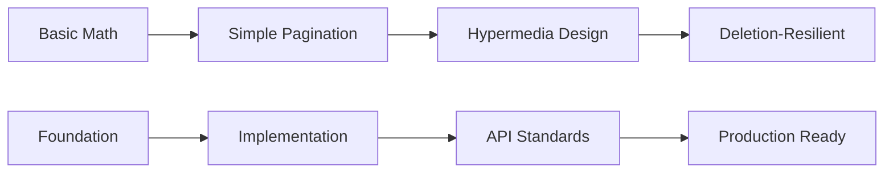

# 0x00. Pagination

<p align="center">
  
  
  
  
</p>

<div align="center">
  <h3>📄 Master Efficient Data Pagination</h3>
  <p><em>Build scalable APIs that handle large datasets with optimal performance</em></p>
</div>

---

## 📋 Table of Contents
- [🎯 Overview](#-overview)
- [🎓 Learning Objectives](#-learning-objectives)
- [📚 Project Tasks](#-project-tasks)
- [🏗️ Architecture](#️-architecture)
- [💡 Core Competencies](#-core-competencies)
- [🔧 Setup & Prerequisites](#-setup--prerequisites)
- [🚀 Getting Started](#-getting-started)
- [📖 Resources](#-resources)
- [👨‍💻 Author](#-author)

## 🎯 Overview

This project introduces the fundamental concepts of **pagination** in web applications and APIs. You'll learn to implement server-side pagination strategies that enable efficient data retrieval and navigation for large datasets, ensuring optimal performance and user experience even with millions of records.

**Real-world Applications:**
- Social media feeds with infinite scroll
- E-commerce product catalogs
- Search engine results
- Database query optimization
- API design for mobile applications

**Industry Standards Covered:**
- RESTful API pagination patterns
- Hypermedia-driven API design (HATEOAS)
- Performance optimization techniques
- Scalable data architecture patterns

## 🎓 Learning Objectives

By the end of this project, you will be able to:

### **Core Technical Skills**
- ✅ **Implement server-side pagination logic** for large datasets
- ✅ **Design RESTful endpoints** that support paginated responses
- ✅ **Handle edge cases** including out-of-range pages and invalid parameters
- ✅ **Optimize database queries** for efficient data retrieval
- ✅ **Create hypermedia-driven APIs** following HATEOAS principles

### **Professional Development**
- 🎯 **API Design Patterns**: Industry-standard pagination implementations
- 🎯 **Performance Engineering**: Optimizing large dataset handling
- 🎯 **User Experience**: Designing smooth navigation experiences
- 🎯 **Scalability Planning**: Building systems that grow with data

### **Industry Practices**
- 📊 **Data Architecture**: Efficient data retrieval strategies
- 📊 **Resource Management**: Memory and computational optimization
- 📊 **Client-Server Communication**: Stateless pagination protocols
- 📊 **Error Handling**: Robust pagination error management

## 📚 Project Tasks

### **Task 0: Simple Helper Function**
**File:** `0-simple_helper_function.py`
- Implement `index_range` function for calculating pagination indices
- Practice basic pagination mathematics and boundary calculations
- Foundation for all pagination implementations

### **Task 1: Simple Pagination**
**File:** `1-simple_pagination.py`
- Create `Server` class with basic pagination functionality
- Implement `get_page` method with page and page_size parameters
- Handle edge cases and invalid inputs gracefully

### **Task 2: Hypermedia Pagination**
**File:** `2-hypermedia_pagination.py`
- Extend pagination with hypermedia metadata
- Include navigation links (next, prev, first, last)
- Implement HATEOAS principles for self-describing APIs

### **Task 3: Deletion-Resilient Hypermedia Pagination**
**File:** `3-hypermedia_del_pagination.py`
- Handle pagination when items are deleted between requests
- Implement stable pagination indices
- Ensure consistent user experience with dynamic datasets

### **📊 Task Complexity Progression**



## 🏗️ Architecture

### **Data Flow Architecture**
```
┌─────────────────┐    ┌─────────────────┐    ┌─────────────────┐
│   Client        │    │   Server        │    │   Data Store    │
│   Request       │───▶│   Pagination    │───▶│   CSV Dataset   │
│   (page, size)  │    │   Logic         │    │   (Baby Names)  │
└─────────────────┘    └─────────────────┘    └─────────────────┘
         ▲                       │                       
         │                       ▼                       
┌─────────────────┐    ┌─────────────────┐                
│   Paginated     │◀───│   Response      │                
│   Response      │    │   Builder       │                
│   + Metadata    │    │   + Hypermedia  │                
└─────────────────┘    └─────────────────┘                
```

### **Core Components**

#### **Server Class**
- Central pagination logic implementation
- Dataset loading and management
- Request parameter validation
- Response formatting and metadata generation

#### **Helper Functions**
- Mathematical utilities for index calculation
- Boundary validation and error handling
- Pagination metadata computation
- Navigation link generation

#### **Response Structure**
```python
{
    "data": [...],           # Current page items
    "page": 1,              # Current page number
    "page_size": 10,        # Items per page
    "total_pages": 45,      # Total available pages
    "next_url": "...",      # Next page link
    "prev_url": "...",      # Previous page link
    "info": {...}           # Additional metadata
}
```

## 💡 Core Competencies

### 🔧 **Technical Skills**

#### **Backend Development**
- **RESTful API Design**: Creating intuitive, standards-compliant APIs
- **Data Management**: Efficient handling of large datasets
- **Performance Optimization**: Minimizing memory usage and response times
- **Error Handling**: Comprehensive edge case management

#### **Algorithm Design**
- **Pagination Mathematics**: Index calculation and boundary management
- **Memory Efficiency**: Processing large datasets without loading everything
- **Time Complexity**: O(1) pagination operations regardless of dataset size
- **Space Optimization**: Minimal memory footprint for pagination metadata

#### **API Architecture**
- **Hypermedia Design**: Self-describing APIs with navigation links
- **Stateless Communication**: No server-side session dependencies
- **Resource Identification**: Clean, predictable URL patterns
- **Content Negotiation**: Flexible response formatting

### 🎯 **Professional Skills**

#### **System Design**
- **Scalability Planning**: Designing for growth from thousands to millions of records
- **Performance Engineering**: Optimizing for speed and efficiency
- **User Experience**: Smooth, predictable navigation patterns
- **Maintainability**: Clean, extensible code architecture

#### **Problem Solving**
- **Edge Case Analysis**: Identifying and handling boundary conditions
- **Trade-off Evaluation**: Balancing performance, simplicity, and features
- **Debugging Skills**: Systematic approach to pagination issues
- **Documentation**: Clear API documentation and usage examples

#### **Industry Practices**
- **Standards Compliance**: Following REST and HATEOAS principles
- **Testing Strategy**: Comprehensive test coverage for pagination logic
- **Code Quality**: Clean, readable, and maintainable implementations
- **Performance Monitoring**: Metrics and optimization strategies

## 🔧 Setup & Prerequisites

### **System Requirements**
- **Python**: 3.7+ (recommended: 3.9+)
- **pip**: Latest version for package management
- **Text Editor**: VS Code with Python extensions recommended
- **Terminal**: For running tests and examples

### **Installation**
```bash
# Verify Python installation
python3 --version
pip3 --version

# Navigate to project directory
cd 0x00-pagination

# No additional dependencies required for basic implementation
# Dataset (Popular_Baby_Names.csv) is included in the project
```

### **Dataset Information**
- **File**: `Popular_Baby_Names.csv`
- **Size**: ~19,000 records of baby name data
- **Structure**: Year, Gender, Ethnicity, Name, Count, Rank
- **Purpose**: Real-world dataset for pagination testing

### **Development Environment Setup**
```bash
# Install optional development tools
pip3 install requests  # For API testing
pip3 install flask     # For web server implementation

# Install testing tools
pip3 install pytest pytest-cov

# Install code quality tools
pip3 install black pylint flake8
```

### **VS Code Configuration (Recommended)**
```json
{
    "python.linting.enabled": true,
    "python.linting.pylintEnabled": true,
    "python.formatting.provider": "black",
    "python.testing.pytestEnabled": true,
    "python.autoComplete.addBrackets": true
}
```

## 🚀 Getting Started

### **Quick Start Guide**

1. **Understand the Dataset**
   ```bash
   # Examine the dataset structure
   head -5 Popular_Baby_Names.csv
   wc -l Popular_Baby_Names.csv  # Count total records
   ```

2. **Start with Basic Helper**
   ```bash
   # Test the basic pagination math
   python3 0-main.py
   
   # Verify index calculations
   python3 -c "from 0_simple_helper_function import index_range; print(index_range(1, 7))"
   ```

3. **Implement Simple Pagination**
   ```bash
   # Test basic pagination functionality
   python3 1-main.py
   
   # Experiment with different page sizes
   python3 -c "
   from 1_simple_pagination import Server
   server = Server()
   print(server.get_page(1, 3))  # First 3 items
   print(server.get_page(2, 3))  # Next 3 items
   "
   ```

4. **Explore Hypermedia Features**
   ```bash
   # Test hypermedia pagination
   python3 2-main.py
   
   # Examine the response structure
   python3 -c "
   from 2_hypermedia_pagination import Server
   server = Server()
   import pprint
   pprint.pprint(server.get_hyper(1, 2))
   "
   ```

5. **Test Deletion Resilience**
   ```bash
   # Test deletion-resilient pagination
   python3 3-main.py
   
   # Simulate real-world scenarios
   python3 -c "
   from 3_hypermedia_del_pagination import Server
   server = Server()
   print('Testing deletion resilience...')
   # Test various scenarios here
   "
   ```

### **Learning Approach**

1. **📐 Mathematical Foundation**: Master pagination index calculations
2. **🏗️ Implementation**: Build pagination logic step by step  
3. **🔗 API Design**: Learn hypermedia and HATEOAS principles
4. **🛡️ Robustness**: Handle edge cases and real-world scenarios
5. **⚡ Optimization**: Improve performance and user experience

### **Development Workflow**
```bash
# Code development cycle
python3 your_file.py           # Test functionality
python3 -m doctest your_file.py # Test embedded examples
black your_file.py             # Format code
pylint your_file.py           # Check code quality

# Testing workflow
python3 -m pytest tests/      # Run comprehensive tests
python3 -m pytest --cov=.     # Check test coverage
```

### **Common Pagination Patterns**
```python
# Basic pagination request
GET /api/items?page=1&page_size=10

# Hypermedia response
{
    "data": [...],
    "page": 1,
    "page_size": 10,
    "next_url": "/api/items?page=2&page_size=10",
    "prev_url": null,
    "total_pages": 45
}

# Deletion-resilient request
GET /api/items?index=100&page_size=10
```

## 📖 Resources

### **Official Documentation**
- [REST API Design Guide](https://restfulapi.net/) - RESTful API best practices
- [HATEOAS Principles](https://restfulapi.net/hateoas/) - Hypermedia-driven API design
- [HTTP Status Codes](https://httpstatuses.com/) - Standard response codes
- [Python CSV Module](https://docs.python.org/3/library/csv.html) - CSV file handling

### **Pagination Strategies**
- [Offset-Based Pagination](https://use-the-index-luke.com/no-offset) - Traditional pagination approach
- [Cursor-Based Pagination](https://slack.engineering/evolving-api-pagination-at-slack/) - Scalable pagination patterns
- [Keyset Pagination](https://use-the-index-luke.com/sql/partial-results/fetch-next-page) - Database-optimized pagination
- [GraphQL Pagination](https://graphql.org/learn/pagination/) - Modern API pagination

### **Performance Optimization**
- [Database Indexing](https://use-the-index-luke.com/) - Optimizing database queries
- [Caching Strategies](https://aws.amazon.com/caching/) - Improving response times
- [API Rate Limiting](https://github.com/visionmedia/node-ratelimiter) - Protecting against abuse
- [Response Compression](https://developer.mozilla.org/en-US/docs/Web/HTTP/Compression) - Reducing bandwidth usage

### **Industry Examples**
- [GitHub API Pagination](https://docs.github.com/en/rest/guides/traversing-with-pagination) - Real-world API design
- [Twitter API Pagination](https://developer.twitter.com/en/docs/twitter-api/pagination) - Social media pagination
- [Stripe API Pagination](https://stripe.com/docs/api/pagination) - Payment API patterns
- [Google API Design Guide](https://cloud.google.com/apis/design/design_patterns#list_pagination) - Google's pagination standards

### **Advanced Topics**
- [Elasticsearch Pagination](https://www.elastic.co/guide/en/elasticsearch/reference/current/paginate-search-results.html) - Search result pagination
- [Redis Pagination](https://redis.io/commands/scan) - In-memory data pagination
- [MongoDB Pagination](https://docs.mongodb.com/manual/reference/method/cursor.skip/) - Document database pagination
- [PostgreSQL Pagination](https://www.postgresql.org/docs/current/queries-limit.html) - SQL pagination optimization

### **Testing & Quality**
- [API Testing Best Practices](https://assertible.com/blog/api-testing-best-practices) - Testing pagination endpoints
- [Performance Testing](https://locust.io/) - Load testing pagination systems
- [API Documentation](https://swagger.io/) - Documenting pagination APIs
- [Error Handling Patterns](https://blog.restcase.com/rest-api-error-codes-101/) - Robust error management

### **Project Context**
- 📚 Main repository: [ALX Backend Engineering](../README.md)
- 🚀 Next project: [Caching Systems](../0x01-caching/README.md)
- 🔄 Related concepts: API design, data management, performance optimization

## 👨‍💻 Author

**ALX Backend Engineering Track**  
*Building scalable, efficient data management systems*

## 📄 License

This project is part of the **ALX Software Engineering curriculum**.  
Educational use only - please respect academic integrity policies.

