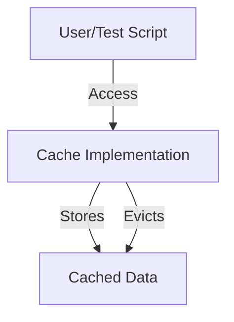

# 1. Project Overview
**Purpose:** Demonstrate and compare core cache replacement strategies for backend systems.

**Scope:** This project covers the design and implementation of multiple cache algorithms (FIFO, LIFO, LRU, MRU, LFU) using Python. It emphasizes extensibility and clarity for educational purposes.

**Key Features:**
- Multiple cache replacement policies
- Abstract base class for extensibility
- Test scripts for each cache type

---

# 2. System Architecture
**Architecture Diagram:**

**Description:**
- User or test script interacts with a cache class instance.
- The cache class manages data storage and eviction based on its policy.

---

# 3. Component Details
- **Base Cache (`base_caching.py`):**
  - *Purpose:* Define the interface and shared logic for all cache classes.
  - *Key Technologies:* Python (ABC)
  - *Responsibilities:* Enforce method signatures, provide default behaviors.
  - *Interactions:* Inherited by all concrete cache classes.
- **Concrete Caches (`*-cache.py`):**
  - *Purpose:* Implement specific cache replacement policies.
  - *Key Technologies:* Python
  - *Responsibilities:* Store, retrieve, and evict data per policy.
  - *Interactions:* Used by test scripts to demonstrate behavior.
- **Test Scripts (`*-main.py`):**
  - *Purpose:* Validate and demonstrate each cache policy.

---

# 4. Data Flow
- User/test script adds and retrieves items from a cache instance.
- Cache class manages storage and eviction transparently.

---

# 5. Deployment & Environment
- No deployment required; run locally with Python 3.x.
- No external dependencies.

---

# 6. Security Considerations
- Not applicable (educational, local use).

---

# 7. Error Handling & Resilience
- Handles invalid operations gracefully (e.g., missing keys).

---

# 8. Design Decisions & Trade-offs
- Chose clarity and modularity for educational value.
- Focused on core algorithms, not production optimizations.

---

# 9. Glossary
- **Cache:** Temporary storage for fast data retrieval.
- **Eviction Policy:** Algorithm for removing items from cache.

---

# 10. Further Reading & References
- [Wikipedia: Cache Replacement Policies](https://en.wikipedia.org/wiki/Cache_replacement_policies)
- [PEP8 Style Guide](https://peps.python.org/pep-0008/)
