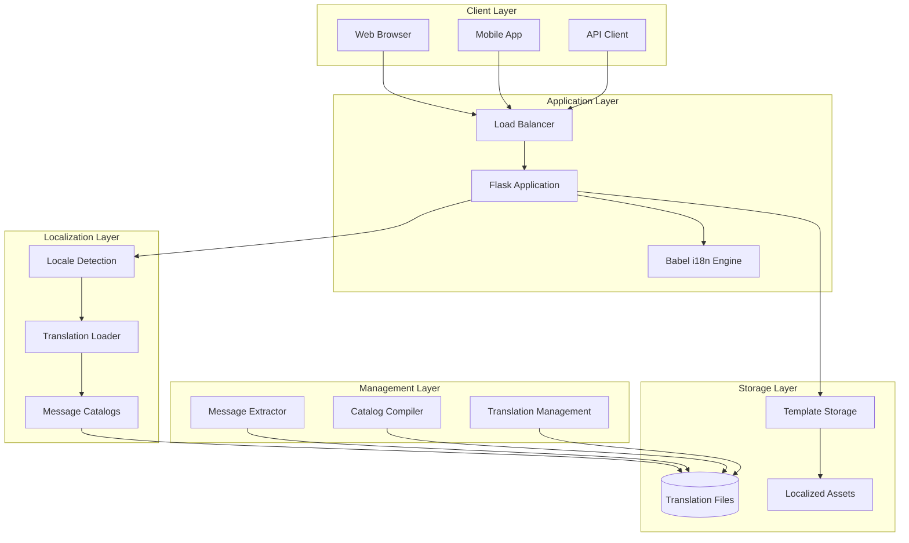
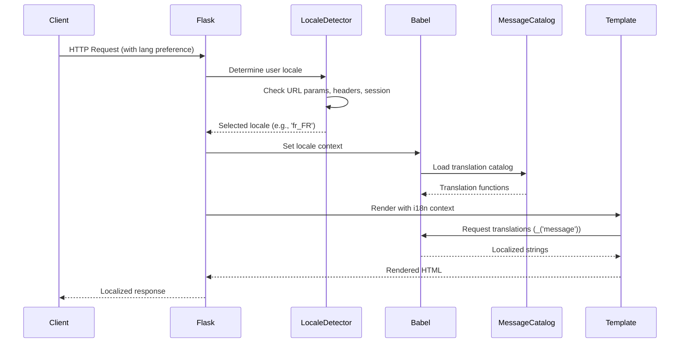
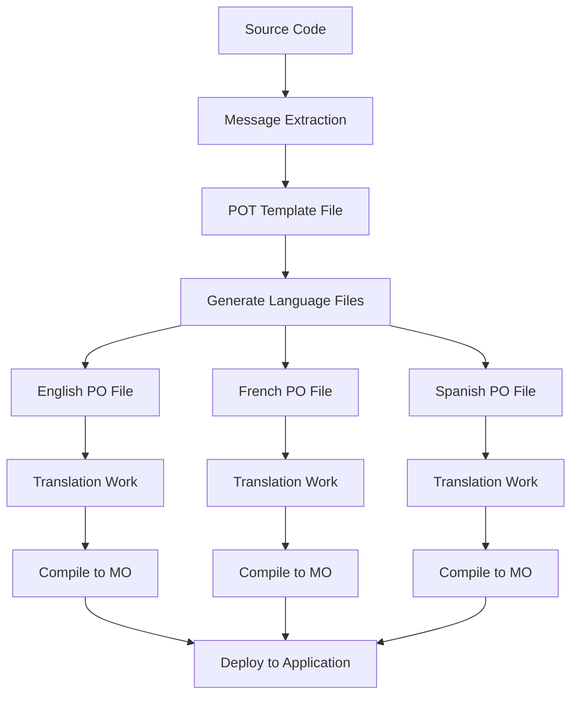

# Architecture Document: Internationalization (i18n) System

## 1. Project Overview

### Strategic Vision
This project implements a comprehensive internationalization (i18n) and localization (l10n) system for web applications, demonstrating enterprise-grade multilingual support patterns. The architecture showcases how modern backend systems handle global user bases with diverse language requirements while maintaining performance and maintainability.

### Problem Statement
In today's globalized digital landscape, applications must serve users across different languages, cultures, and regions. This project addresses the critical need for:
- Seamless language switching without application restarts
- Scalable translation management systems
- Locale-aware content delivery
- Cultural adaptation beyond mere translation
- Performance-optimized multilingual content serving

### Business Value Proposition
- **Global Reach**: Enable applications to serve international markets
- **User Experience**: Provide native-language experiences for diverse user bases
- **Maintenance Efficiency**: Centralized translation management and automated workflows
- **Scalability**: Architecture supports adding new languages without code changes
- **Compliance**: Meet international accessibility and localization standards

## 2. System Architecture

### High-Level Architecture



### Architectural Patterns
1. **Localization Middleware Pattern**: Central locale detection and context setting
2. **Translation Catalog Pattern**: Structured message storage and retrieval
3. **Template Inheritance Pattern**: Reusable localized template components
4. **Fallback Chain Pattern**: Graceful degradation for missing translations

### Technology Stack
- **Core Framework**: Flask (Python web framework)
- **i18n Engine**: Flask-Babel (internationalization extension)
- **Template Engine**: Jinja2 (with i18n extensions)
- **Message Processing**: GNU gettext (industry standard)
- **Configuration**: YAML/JSON for locale settings

## 3. Component Architecture

### Core Components

#### 3.1 Flask Application Core
```python
# Primary responsibilities:
- Request routing and handling
- Locale context management
- Template rendering with i18n support
- Configuration and initialization
```

**Key Features:**
- Centralized locale detection logic
- Request-scoped translation context
- Automatic template variable injection
- Error handling with localized messages

#### 3.2 Babel Integration Layer
```python
# Translation management:
- Message extraction from source code
- Catalog compilation and optimization
- Runtime translation lookup
- Pluralization rule handling
```

**Capabilities:**
- Automatic string extraction from Python and template files
- Support for complex pluralization rules across languages
- Lazy loading of translation catalogs for performance
- Context-aware translation selection

#### 3.3 Locale Detection Engine
```python
# Multi-source locale determination:
- URL parameter analysis (?lang=en)
- Accept-Language header parsing
- User session preferences
- Geographic IP detection (optional)
```

**Decision Hierarchy:**
1. Explicit URL parameter (highest priority)
2. User session/cookie preferences
3. Browser Accept-Language header
4. Application default locale (fallback)

#### 3.4 Translation Management System
```python
# Catalog lifecycle management:
- Source code message extraction
- Translation file generation (POT files)
- Language-specific catalog creation (PO files)
- Binary catalog compilation (MO files)
```

## 4. Data Flow Architecture

### Request Processing Flow



### Translation Workflow



## 5. Deployment Architecture

### Development Environment
```yaml
Environment: Local Development
Components:
  - Flask development server
  - File-based translation catalogs
  - Hot-reload for template changes
  - Debug mode with translation debugging

Dependencies:
  - Python 3.8+
  - Flask 2.0+
  - Flask-Babel 2.0+
  - Babel 2.9+
```

### Production Environment
```yaml
Environment: Production Deployment
Components:
  - WSGI server (Gunicorn/uWSGI)
  - Compiled translation catalogs (.mo files)
  - CDN for localized static assets
  - Caching layer for translation lookup

Optimizations:
  - Precompiled message catalogs
  - Translation caching in memory/Redis
  - Lazy loading of unused languages
  - Asset versioning for cache busting
```

### Scalability Considerations
- **Horizontal Scaling**: Stateless design enables load balancing
- **Translation Caching**: Redis/Memcached for translation lookup optimization
- **CDN Integration**: Serve localized assets from edge locations
- **Lazy Loading**: Load only required translation catalogs

## 6. Security Architecture

### Security Considerations
1. **Input Validation**: Locale parameter sanitization
2. **Path Traversal Prevention**: Secure template and translation file access
3. **XSS Protection**: Proper escaping of translated content
4. **CSRF Protection**: Secure form handling across locales

### Security Implementation
```python
# Locale validation
SUPPORTED_LOCALES = ['en', 'fr', 'es', 'de']
def validate_locale(locale):
    return locale if locale in SUPPORTED_LOCALES else 'en'

# Template security
from markupsafe import escape
def safe_translate(message, **kwargs):
    return escape(_(message) % kwargs)
```

## 7. Error Handling & Resilience

### Graceful Degradation Strategy
1. **Missing Translations**: Fall back to default language (English)
2. **Invalid Locales**: Redirect to supported locale or default
3. **Catalog Loading Errors**: Use cached translations or fallback catalog
4. **Template Errors**: Render basic version without i18n features

### Error Recovery Mechanisms
```python
# Translation fallback chain
def get_translation(message, locale='en'):
    try:
        return catalog[locale][message]
    except KeyError:
        try:
            return catalog['en'][message]  # Fallback to English
        except KeyError:
            return message  # Return original message
```

## 8. Performance Optimization

### Optimization Strategies
1. **Catalog Caching**: In-memory caching of compiled translations
2. **Lazy Loading**: Load translations only when needed
3. **Template Compilation**: Pre-compile templates with translations
4. **Asset Optimization**: Minify and compress localized assets

### Performance Metrics
- Translation lookup time: < 1ms
- Locale detection time: < 5ms
- Template rendering time: < 50ms
- Memory usage per locale: < 10MB

## 9. Design Decisions & Trade-offs

### Key Architectural Decisions

| Decision | Rationale | Trade-offs |
|----------|-----------|------------|
| Flask-Babel over custom solution | Mature, well-tested, community support | Less flexibility for custom requirements |
| gettext format for translations | Industry standard, tool ecosystem | Learning curve for non-technical translators |
| Session-based locale persistence | Better UX, maintains user preference | Increased session storage requirements |
| Template-level translation | Fine-grained control, designer-friendly | More complex template management |

### Alternative Approaches Considered
1. **Database-stored translations**: More dynamic but slower and complex
2. **JSON-based translation files**: Simpler but lacks gettext features
3. **Client-side i18n**: Faster rendering but SEO challenges
4. **Microservice for translations**: Better scalability but added complexity

## 10. Integration Patterns

### External System Integration
- **Translation Services**: Integration with Google Translate API for automated translations
- **Content Management**: CMS integration for dynamic content localization
- **Analytics**: Tracking language usage and user preferences
- **A/B Testing**: Testing different translations and cultural adaptations

### API Design for i18n
```python
# RESTful API with locale support
GET /api/v1/content?lang=fr
Accept-Language: fr-FR,fr;q=0.9,en;q=0.8

Response:
{
    "locale": "fr_FR",
    "content": {
        "title": "Bienvenue",
        "description": "Application multilingue"
    }
}
```

## 11. Monitoring & Observability

### Key Metrics
- Translation coverage percentage per language
- Locale detection accuracy
- Translation lookup performance
- User language preferences distribution

### Logging Strategy
```python
# Structured logging for i18n events
logger.info("locale_detected", {
    "user_id": user.id,
    "detected_locale": locale,
    "detection_method": "browser_header",
    "fallback_used": False
})
```

## 12. Future Enhancements

### Roadmap Considerations
1. **Right-to-Left (RTL) Language Support**: Arabic, Hebrew layout handling
2. **Cultural Adaptation**: Date, time, number formatting per locale
3. **Dynamic Translation Loading**: Runtime translation updates without deployment
4. **AI-Powered Translation**: Integration with machine learning translation services
5. **Accessibility**: Screen reader optimization for different languages

### Scalability Evolution
- **Microservice Architecture**: Dedicated translation service
- **Edge Computing**: Locale-aware edge functions
- **Machine Learning**: Automatic translation quality improvement
- **Real-time Collaboration**: Live translation editing and deployment

## 13. Conclusion

This internationalization architecture provides a robust foundation for building globally accessible web applications. The design emphasizes maintainability, performance, and scalability while following industry best practices for multilingual software development.

The modular approach allows for incremental adoption of i18n features and provides clear pathways for scaling to support additional languages and cultural requirements as applications grow to serve global audiences.
