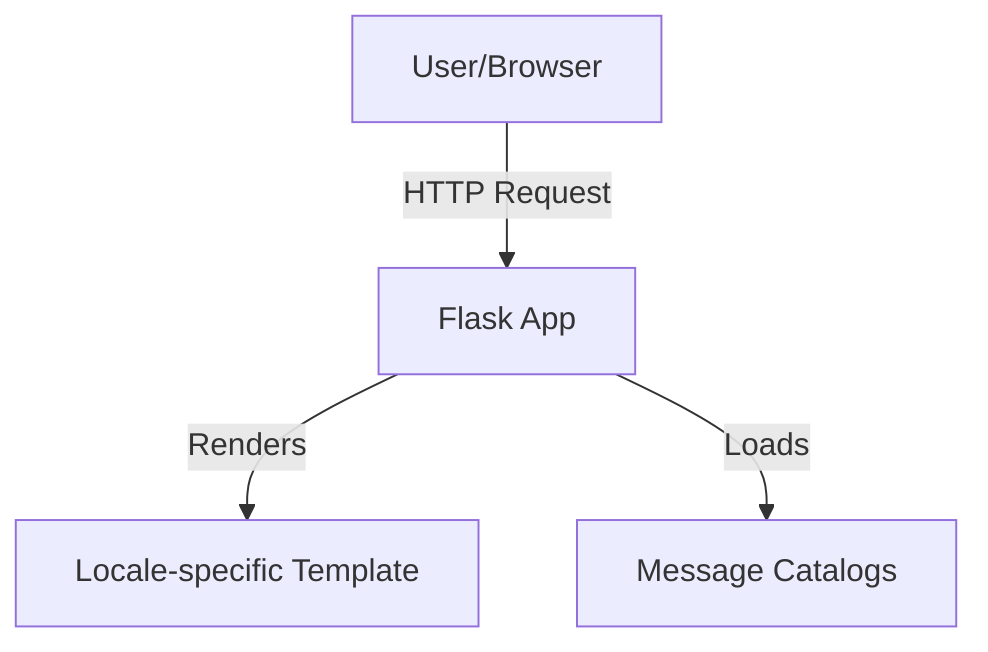

# 1. Project Overview
**Purpose:** Introduce and implement internationalization (i18n) and localization (l10n) in backend web applications, enabling support for multiple languages and locales.

**Scope:** This project covers the design and implementation of language selection, translation management, and locale-aware responses using Python, Flask, and Babel.

**Key Features:**
- Multilingual Flask application
- Language selection via query parameters or headers
- Message extraction and translation management with Babel
- Locale-aware template rendering

---

# 2. System Architecture
**Architecture Diagram:**

**Description:**
- The client sends HTTP requests, optionally specifying a preferred language.
- The Flask app determines the locale, loads the appropriate translations, and renders the correct template.

---

# 3. Component Details
- **Flask App (`app.py`, `*-app.py`):**
  - *Purpose:* Serve web pages with locale-aware content.
  - *Key Technologies:* Python, Flask, Flask-Babel
  - *Responsibilities:* Handle requests, select language, render templates.
- **Babel Config (`babel.cfg`):**
  - *Purpose:* Configure message extraction for translation.
- **Translations (`translations/`):**
  - *Purpose:* Store language-specific message catalogs.
- **Templates (`templates/`):**
  - *Purpose:* Provide HTML templates for different locales.

---

# 4. Data Flow
- User requests a page with a language preference (query param or header).
- Flask app determines locale, loads translations, and renders the template.

---

# 5. Deployment & Environment
- Run locally with Python 3.x, Flask, and Babel.
- No special deployment required.

---

# 6. Security Considerations
- Input validation for locale parameters.
- No sensitive data handled.

---

# 7. Error Handling & Resilience
- Fallback to default language if translation is missing.

---

# 8. Design Decisions & Trade-offs
- Chose Flask-Babel for simplicity and integration with Flask.
- Focused on educational clarity over production scalability.

---

# 9. Glossary
- **i18n:** Internationalization
- **l10n:** Localization
- **Locale:** Language and regional settings

---

# 10. Further Reading & References
- [Flask-Babel Documentation](https://pythonhosted.org/Flask-Babel/)
- [Babel Documentation](http://babel.pocoo.org/en/latest/)
