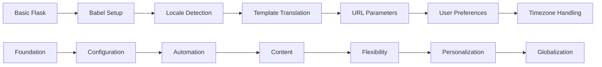

# 0x02. i18n (Internationalization)

<p align="center">
  
  
  
  
  
</p>

<div align="center">
  <h3>🌍 Build Globally Accessible Applications</h3>
  <p><em>Master internationalization and localization for worldwide user reach</em></p>
</div>

---

## 📋 Table of Contents
- [🎯 Overview](#-overview)
- [🎓 Learning Objectives](#-learning-objectives)
- [📚 Project Tasks](#-project-tasks)
- [🏗️ Architecture](#️-architecture)
- [💡 Core Competencies](#-core-competencies)
- [🔧 Setup & Prerequisites](#-setup--prerequisites)
- [🚀 Getting Started](#-getting-started)
- [📖 Resources](#-resources)
- [👨‍💻 Author](#-author)

## 🎯 Overview

This project introduces **internationalization (i18n)** and **localization (l10n)** concepts for building multilingual backend applications. You'll learn to implement language selection, translation management, and locale-aware responses using Python, Flask, and Babel, enabling your applications to serve global audiences effectively.

**Real-world Applications:**
- Global SaaS platforms (Slack, GitHub, Shopify)
- E-commerce marketplaces (Amazon, eBay)
- Social media platforms (Facebook, Twitter)
- Educational platforms (Coursera, Duolingo)
- Enterprise software solutions
- Government and public services websites

**Global Impact:**
- **Market Reach**: Access to billions of non-English speaking users
- **User Experience**: Native language engagement and comfort
- **Cultural Sensitivity**: Respect for local customs and preferences
- **Legal Compliance**: Meeting international accessibility requirements

## 🎓 Learning Objectives

By the end of this project, you will be able to:

### **Core Technical Skills**
- ✅ **Implement Flask-Babel integration** for internationalization
- ✅ **Create and manage translation files** using gettext and PO files
- ✅ **Build locale-aware templates** with dynamic content translation
- ✅ **Handle language selection** through URLs, headers, and user preferences
- ✅ **Format dates, times, and numbers** according to locale conventions

### **Professional Development**
- 🎯 **Global Product Development**: Building for international markets
- 🎯 **Cultural Competency**: Understanding diverse user needs
- 🎯 **Technical Localization**: Implementing region-specific features
- 🎯 **User Experience Design**: Creating intuitive language switching

### **Industry Practices**
- 📊 **Translation Workflow Management**: Professional translation processes
- 📊 **Content Management**: Dynamic multilingual content systems
- 📊 **Performance Optimization**: Efficient locale-specific serving
- 📊 **Testing Strategies**: Comprehensive multilingual testing approaches

## 📚 Project Tasks

### **Task 0: Basic Flask App**
**File:** `0-app.py`
- Set up basic Flask application with single route
- Create foundation template structure
- Establish development environment for i18n

### **Task 1: Basic Babel Setup**
**File:** `1-app.py`
- Configure Flask-Babel extension
- Set up language configuration (English and French)
- Initialize Babel with default locale and timezone

### **Task 2: Get Locale from Request**
**File:** `2-app.py`
- Implement locale detection from request headers
- Create `get_locale()` function with `@babel.localeselector`
- Handle Accept-Language header parsing

### **Task 3: Parametrize Templates**
**File:** `3-app.py`
- Create message IDs for translatable strings
- Implement `_()` function for marking translatable text
- Set up translation extraction workflow

### **Task 4: Force Locale with URL Parameter**
**File:** `4-app.py`
- Add URL parameter-based locale selection
- Implement locale priority: URL > headers > default
- Handle invalid locale parameters gracefully

### **Task 5: Mock User Login System**
**File:** `5-app.py`
- Create user database with language preferences
- Implement user login simulation
- Display personalized welcome messages

### **Task 6: Use User Locale**
**File:** `6-app.py`
- Implement user preference-based locale selection
- Priority order: URL > user settings > headers > default
- Demonstrate user-specific localization

### **Task 7: Infer Appropriate Time Zone**
**File:** `7-app.py`
- Add timezone detection and handling
- Display current time in user's timezone
- Handle timezone parameter validation

### **📊 Progressive Complexity**



## 🏗️ Architecture

### **i18n System Architecture**
```
┌─────────────────┐    ┌─────────────────┐    ┌─────────────────┐
│   User Request  │    │   Locale        │    │   Translation   │
│   (Headers/URL) │───▶│   Detection     │───▶│   System        │
│                 │    │   Engine        │    │   (Babel)       │
└─────────────────┘    └─────────────────┘    └─────────────────┘
         ▲                       │                       │
         │                       ▼                       ▼
┌─────────────────┐    ┌─────────────────┐    ┌─────────────────┐
│   Localized     │◀───│   Template      │◀───│   PO Files      │
│   Response      │    │   Rendering     │    │   (Translations)│
│   (Content)     │    │   Engine        │    │   fr/en/es...   │
└─────────────────┘    └─────────────────┘    └─────────────────┘
```

### **Translation Workflow**
```
1. Extract Messages → 2. Create POT file → 3. Generate PO files → 4. Translate → 5. Compile MO files
   (pybabel extract)     (messages.pot)      (locale-specific)    (Human)     (pybabel compile)
```

### **Locale Selection Priority**
```python
def get_locale():
    # 1. URL parameter (?locale=fr)
    if request.args.get('locale') in app.config['LANGUAGES']:
        return request.args.get('locale')
    
    # 2. User preference (if logged in)
    if g.user and g.user.get('locale') in app.config['LANGUAGES']:
        return g.user['locale']
    
    # 3. Request headers (Accept-Language)
    return request.accept_languages.best_match(app.config['LANGUAGES'])
    
    # 4. Default locale
    return app.config['BABEL_DEFAULT_LOCALE']
```

## 💡 Core Competencies

### 🔧 **Technical Skills**

#### **Internationalization Implementation**
- **Flask-Babel Integration**: Seamless i18n setup and configuration
- **Message Extraction**: Automated translatable string identification
- **Template Localization**: Dynamic content translation in Jinja2 templates
- **Locale Management**: Efficient locale detection and switching

#### **Translation Management**
- **Gettext Workflow**: Professional translation file management
- **PO File Handling**: Creating and maintaining translation catalogs
- **Message Compilation**: Optimized translation delivery
- **Version Control**: Managing translations across releases

#### **Cultural Adaptation**
- **Date/Time Formatting**: Locale-specific temporal representations
- **Number Formatting**: Currency, decimals, and number systems
- **Text Direction**: Support for RTL (Right-to-Left) languages
- **Cultural Context**: Adapting content for local customs

### 🎯 **Professional Skills**

#### **Global Product Development**
- **Market Analysis**: Understanding international user requirements
- **Feature Localization**: Adapting functionality for regional needs
- **Content Strategy**: Planning multilingual content architecture
- **Release Management**: Coordinating global product launches

#### **User Experience Design**
- **Language Switching**: Intuitive locale selection interfaces
- **Content Layout**: Handling variable text length across languages
- **Navigation Design**: Culturally appropriate information architecture
- **Accessibility**: Meeting international accessibility standards

#### **Technical Project Management**
- **Translation Workflows**: Coordinating professional translation teams
- **Quality Assurance**: Testing across multiple languages and locales
- **Performance Optimization**: Efficient multilingual content delivery
- **Maintenance Planning**: Long-term translation maintenance strategies

## 🔧 Setup & Prerequisites

### **System Requirements**
- **Python**: 3.7+ with pip package manager
- **Flask**: Web framework for application development
- **Babel**: Internationalization library for Python
- **Text Editor**: VS Code with i18n extensions recommended

### **Installation**
```bash
# Verify Python installation
python3 --version
pip3 --version

# Navigate to project directory
cd 0x02-i18n

# Install required dependencies
pip3 install Flask==2.0.1
pip3 install Flask-Babel==2.0.0

# Verify installations
python3 -c "import flask; import flask_babel; print('Dependencies installed successfully')"
```

### **Project Structure Setup**
```bash
# Create project structure
mkdir -p templates translations

# Verify required files exist
ls -la
# Should see: app.py, babel.cfg, messages.pot, templates/, translations/
```

### **Babel Configuration**
**File:** `babel.cfg`
```ini
[python: **.py]
[jinja2: **/templates/**.html]
extensions=jinja2.ext.autoescape,jinja2.ext.with_
```

### **Development Environment Setup**
```bash
# Install development tools
pip3 install python-babel     # Babel CLI tools
pip3 install pytest          # Testing framework
pip3 install black pylint    # Code quality tools

# Install optional utilities
pip3 install pytz            # Timezone handling
pip3 install babel           # Extended locale data
```

### **VS Code Extensions (Recommended)**
- **Python**: Official Python extension
- **Jinja**: Template syntax highlighting
- **gettext**: PO file editing support
- **Language Pack**: Your target language packs for testing

## 🚀 Getting Started

### **Quick Start Guide**

1. **Set Up Basic Flask App**
   ```bash
   # Test basic application
   python3 0-app.py
   
   # Open browser to http://127.0.0.1:5000
   # Should see "Welcome to Holberton" message
   ```

2. **Configure Babel Integration**
   ```bash
   # Test Babel setup
   python3 1-app.py
   
   # Verify Babel configuration
   python3 -c "
   from 1_app import app
   with app.app_context():
       from flask_babel import get_locale
       print(f'Default locale: {get_locale()}')
   "
   ```

3. **Extract and Create Translations**
   ```bash
   # Extract translatable messages
   pybabel extract -F babel.cfg -k _l -o messages.pot .
   
   # Initialize French translations
   pybabel init -i messages.pot -d translations -l fr
   
   # Initialize Spanish translations (optional)
   pybabel init -i messages.pot -d translations -l es
   
   # Check created structure
   ls -la translations/
   ```

4. **Edit Translation Files**
   ```bash
   # Edit French translations
   nano translations/fr/LC_MESSAGES/messages.po
   
   # Example translation:
   # msgid "Hello world!"
   # msgstr "Bonjour le monde!"
   
   # Compile translations
   pybabel compile -d translations
   ```

5. **Test Multilingual Application**
   ```bash
   # Run application with translations
   python3 3-app.py
   
   # Test different locales:
   # http://127.0.0.1:5000/?locale=en
   # http://127.0.0.1:5000/?locale=fr
   
   # Test with curl
   curl -H "Accept-Language: fr" http://127.0.0.1:5000/
   ```

### **Development Workflow**

1. **🔧 Setup**: Configure Flask-Babel and directory structure
2. **📝 Mark Strings**: Use `_()` function to mark translatable content
3. **🔍 Extract**: Use pybabel extract to create message catalogs
4. **🌍 Translate**: Add translations to PO files
5. **⚙️ Compile**: Generate binary MO files for production
6. **🧪 Test**: Verify functionality across all supported locales

### **Translation Management Workflow**
```bash
# Complete translation workflow
# 1. Extract new/updated messages
pybabel extract -F babel.cfg -k _l -o messages.pot .

# 2. Update existing translations
pybabel update -i messages.pot -d translations

# 3. Edit translation files
# (Open translations/*/LC_MESSAGES/messages.po in editor)

# 4. Compile for production
pybabel compile -d translations

# 5. Test application
python3 app.py
```

### **Common Translation Patterns**
```python
# Simple message translation
_('Hello, World!')

# Variable interpolation
_('Hello, %(username)s!', username=user.name)

# Pluralization
from flask_babel import ngettext
ngettext(
    'You have %(num)d item',
    'You have %(num)d items',
    count
)

# Date/time formatting
from flask_babel import format_datetime
format_datetime(datetime.now(), 'medium')

# Number formatting
from flask_babel import format_currency
format_currency(99.99, 'USD')
```

## 📖 Resources

### **Official Documentation**
- [Flask-Babel Documentation](https://flask-babel.tkte.ch/) - Complete Flask i18n guide
- [Babel Documentation](http://babel.pocoo.org/) - Python internationalization library
- [Flask Internationalization](https://flask.palletsprojects.com/en/2.0.x/patterns/i18n/) - Flask i18n patterns
- [GNU gettext](https://www.gnu.org/software/gettext/) - Translation system foundation

### **Internationalization Standards**
- [Unicode Standard](https://unicode.org/standard/standard.html) - Character encoding guidelines
- [ISO 639 Language Codes](https://en.wikipedia.org/wiki/List_of_ISO_639-1_codes) - Language identification
- [ISO 3166 Country Codes](https://en.wikipedia.org/wiki/ISO_3166-1_alpha-2) - Country identification
- [BCP 47 Language Tags](https://tools.ietf.org/html/bcp47) - Language tag specification

### **Localization Best Practices**
- [W3C Internationalization](https://www.w3.org/International/) - Web i18n guidelines
- [Mozilla L10n Guide](https://mozilla-l10n.github.io/localizer-documentation/) - Localization practices
- [Google I18n Style Guide](https://developers.google.com/style/translation) - Translation guidelines
- [Apple Localization Guide](https://developer.apple.com/localization/) - Platform localization

### **Cultural and Regional Considerations**
- [Cultural Dimensions](https://geert-hofstede.com/cultural-dimensions.html) - Cultural analysis framework
- [Right-to-Left Languages](https://www.w3.org/International/questions/qa-html-dir) - RTL support guidelines
- [Date/Time Formats](https://en.wikipedia.org/wiki/Date_format_by_country) - Regional formatting
- [Currency Formatting](https://en.wikipedia.org/wiki/Currency_symbol) - International currency display

### **Translation Tools and Services**
- [Poedit](https://poedit.net/) - PO file editor
- [Weblate](https://weblate.org/) - Web-based translation platform
- [Crowdin](https://crowdin.com/) - Translation management platform
- [Phrase](https://phrase.com/) - Professional localization platform

### **Advanced Topics**
- [Plural Rules](http://www.unicode.org/cldr/charts/latest/supplemental/language_plural_rules.html) - Language-specific pluralization
- [CLDR Data](http://cldr.unicode.org/) - Common Locale Data Repository
- [ICU Library](http://site.icu-project.org/) - International Components for Unicode
- [Context-Aware Translation](https://www.gnu.org/software/gettext/manual/html_node/Contexts.html) - Context-specific translations

### **Industry Examples**
- [Airbnb Internationalization](https://medium.com/airbnb-engineering/airbnbs-internationalization-platform-45b85de63d09) - Large-scale i18n
- [GitHub Localization](https://github.blog/2021-06-30-bringing-localization-to-github/) - Platform localization strategy
- [WordPress i18n](https://developer.wordpress.org/plugins/internationalization/) - CMS internationalization
- [React Internationalization](https://react.i18next.com/) - Modern frontend i18n

### **Testing and Quality Assurance**
- [Pseudo-localization](https://en.wikipedia.org/wiki/Pseudolocalization) - i18n testing technique
- [Localization Testing](https://www.guru99.com/localization-testing.html) - QA strategies
- [Character Encoding](https://www.w3.org/International/questions/qa-choosing-encodings) - UTF-8 best practices
- [Browser Testing](https://developer.mozilla.org/en-US/docs/Web/HTTP/Headers/Accept-Language) - Cross-browser i18n

### **Project Context**
- 📚 Main repository: [ALX Backend Engineering](../README.md)
- 🚀 Previous project: [Caching Systems](../0x01-caching/README.md)
- ⚡ Next project: [Queuing System in JS](../0x03-queuing_system_in_js/README.md)
- 🔄 Related concepts: Global user experience, cultural adaptation, content management

## 👨‍💻 Author

**ALX Backend Engineering Track**  
*Building globally accessible, culturally aware applications*

## 📄 License

This project is part of the **ALX Software Engineering curriculum**.  
Educational use only - please respect academic integrity policies.
