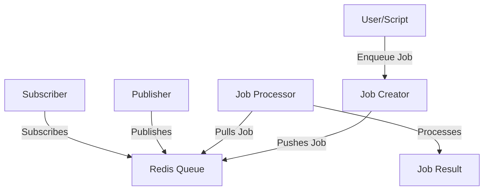

# 1. Project Overview
**Purpose:** Introduce and implement queuing systems in backend applications, focusing on job queues, workers, and real-time notifications using Node.js and Redis.

**Scope:** This project covers the design and implementation of job queues, asynchronous processing, and publish/subscribe patterns in a Node.js environment with Redis as the backend.

**Key Features:**
- Job queue and worker implementation
- Redis-based publish/subscribe
- Asynchronous job processing
- Stock management with queues
- Automated tests for queue logic

---

# 2. System Architecture
**Architecture Diagram:**

**Description:**
- The client or script enqueues jobs via the job creator module.
- Jobs are pushed to a Redis queue.
- Job processors pull jobs from Redis and process them asynchronously.
- Publisher/subscriber modules demonstrate real-time notifications.

---

# 3. Component Details
- **Redis Client (`0-redis_client.js`):**
  - *Purpose:* Establish connection to Redis server.
- **Redis Operations (`1-redis_op.js`, `2-redis_op_async.js`, `4-redis_advanced_op.js`):**
  - *Purpose:* Perform various Redis operations (sync, async, advanced).
- **Pub/Sub (`5-publisher.js`, `5-subscriber.js`):**
  - *Purpose:* Demonstrate publish/subscribe pattern.
- **Job Queue & Worker (`6-job_creator.js`, `6-job_processor.js`, `7-job_creator.js`, `7-job_processor.js`, `8-job.js`, `8-job.test.js`):**
  - *Purpose:* Implement and test job queue and worker logic.
- **Stock Management (`9-stock.js`):**
  - *Purpose:* Manage stock using queue-based logic.

---

# 4. Data Flow
- Job creators enqueue jobs to Redis.
- Job processors pull and process jobs asynchronously.
- Pub/sub modules send and receive real-time messages.

---

# 5. Deployment & Environment
- Requires Node.js and Redis server running locally or remotely.
- Install dependencies with `npm install`.

---

# 6. Security Considerations
- Validate job data before processing.
- Handle Redis connection errors gracefully.

---

# 7. Error Handling & Resilience
- Retry logic for failed jobs (if implemented).
- Graceful shutdown of workers.

---

# 8. Design Decisions & Trade-offs
- Chose Redis for simplicity and real-time capabilities.
- Focused on educational clarity over production scalability.

---

# 9. Glossary
- **Queue:** Data structure for managing jobs in order.
- **Worker:** Process that pulls and executes jobs from the queue.
- **Pub/Sub:** Publish/subscribe messaging pattern.

---

# 10. Further Reading & References
- [Redis Documentation](https://redis.io/documentation)
- [Node.js Documentation](https://nodejs.org/en/docs/)
