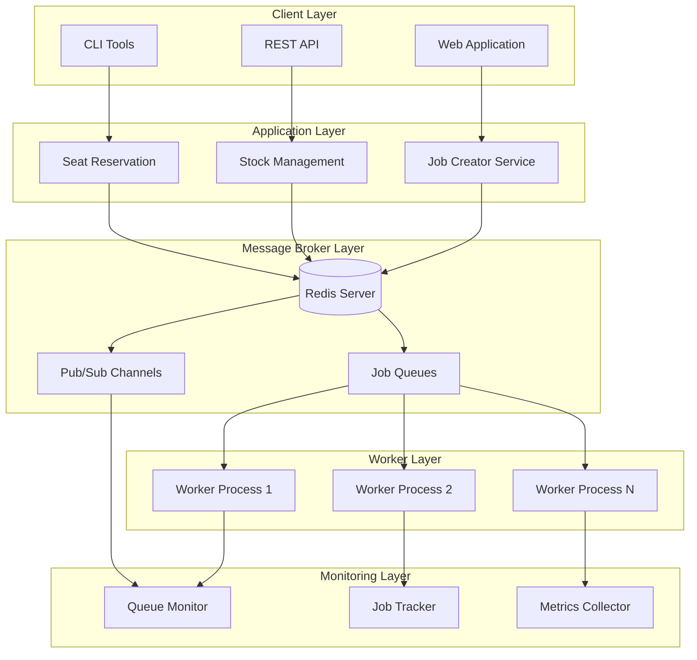
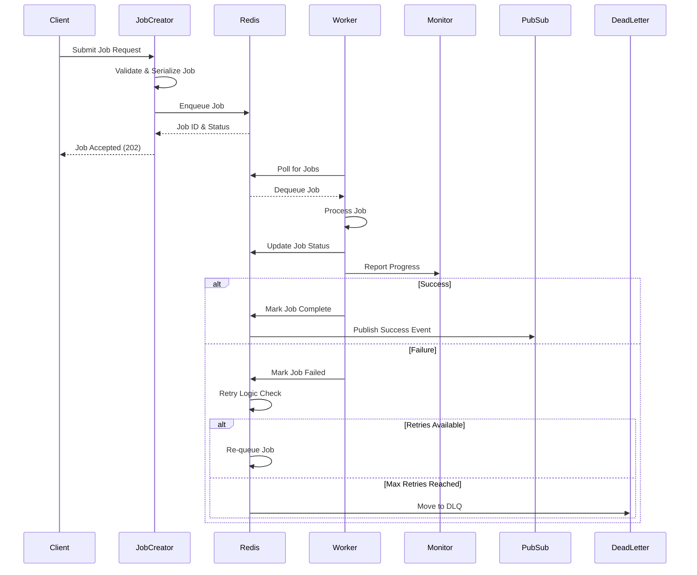
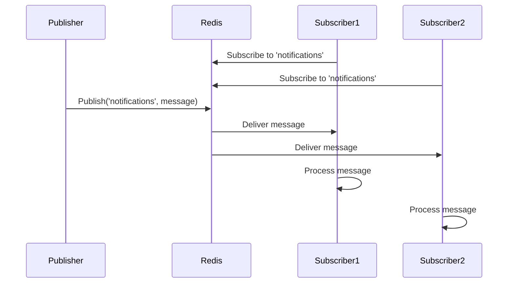

# Architecture Document: Distributed Queuing System in JavaScript

## 1. Project Overview

### Strategic Vision
This project implements a comprehensive distributed queuing system using Node.js and Redis, demonstrating enterprise-grade asynchronous processing patterns essential for scalable backend architectures. The system showcases how modern applications handle background processing, job orchestration, and real-time communication at scale.

### Problem Statement
Modern web applications face critical challenges in handling computationally expensive tasks, managing concurrent operations, and providing responsive user experiences. This project addresses:
- Asynchronous processing of time-consuming operations
- Scalable job distribution across multiple worker processes
- Real-time communication between system components
- Fault tolerance and resilience in distributed systems
- Resource optimization through efficient task scheduling

### Business Value Proposition
- **Performance**: Offload heavy computations to background workers
- **Scalability**: Horizontal scaling through distributed worker pools
- **Reliability**: Fault-tolerant job processing with retry mechanisms
- **User Experience**: Non-blocking operations for responsive interfaces
- **Resource Efficiency**: Optimal utilization of system resources through queuing

## 2. System Architecture

### High-Level Architecture



### Architectural Patterns
1. **Producer-Consumer Pattern**: Job creation and processing separation
2. **Publish-Subscribe Pattern**: Real-time event notification system
3. **Worker Pool Pattern**: Distributed processing across multiple workers
4. **Message Queue Pattern**: Reliable asynchronous communication
5. **Circuit Breaker Pattern**: Fault tolerance and service protection

### Technology Stack
- **Runtime**: Node.js (v14+ with ES6+ features)
- **Message Broker**: Redis (in-memory data structure store)
- **Queue Management**: Kue/Bull (Redis-based queue libraries)
- **Testing Framework**: Mocha + Chai (behavior-driven testing)
- **Process Management**: PM2 (production process manager)

## 3. Component Architecture

### Core Components

#### 3.1 Redis Connection Manager
```javascript
// Connection management and pooling
class RedisConnectionManager {
    constructor(config) {
        this.config = config;
        this.connections = new Map();
        this.reconnectStrategy = new ExponentialBackoff();
    }
    
    async getConnection(purpose = 'default') {
        // Connection pooling and health checking
    }
}
```

**Responsibilities:**
- Connection pool management and optimization
- Automatic reconnection with exponential backoff
- Health monitoring and failover handling
- Resource cleanup and connection lifecycle management

#### 3.2 Job Queue Management System
```javascript
// Advanced job queue with priorities and delays
class JobQueueManager {
    constructor(redis) {
        this.redis = redis;
        this.queues = new Map();
        this.processors = new Map();
    }
    
    async enqueue(queueName, jobData, options = {}) {
        // Job validation, serialization, and queuing
    }
    
    async process(queueName, processor, concurrency = 1) {
        // Worker registration and job processing
    }
}
```

**Features:**
- Priority-based job scheduling
- Delayed job execution capabilities
- Job retry mechanisms with exponential backoff
- Dead letter queue for failed jobs
- Job progress tracking and status updates

#### 3.3 Publish-Subscribe Communication Hub
```javascript
// Real-time messaging system
class PubSubManager {
    constructor(redis) {
        this.redis = redis;
        this.subscribers = new Map();
        this.channels = new Set();
    }
    
    async publish(channel, message) {
        // Message publishing with validation
    }
    
    async subscribe(channel, handler) {
        // Channel subscription management
    }
}
```

**Capabilities:**
- Channel-based message routing
- Pattern-based subscriptions (wildcards)
- Message serialization and deserialization
- Subscriber lifecycle management
- Message persistence and replay options

#### 3.4 Worker Process Management
```javascript
// Scalable worker orchestration
class WorkerManager {
    constructor(config) {
        this.workers = [];
        this.config = config;
        this.healthChecker = new HealthChecker();
    }
    
    async startWorkers(count = os.cpus().length) {
        // Worker process spawning and management
    }
    
    async gracefulShutdown() {
        // Clean worker termination
    }
}
```

## 4. Data Flow Architecture

### Job Processing Flow



### Real-time Communication Flow



## 5. Deployment Architecture

### Development Environment
```yaml
Environment: Local Development
Components:
  - Node.js runtime (v14+)
  - Redis server (local instance)
  - Development tools (nodemon, debugging)
  
Configuration:
  - Redis: localhost:6379
  - Concurrency: Single worker per queue
  - Logging: Console output with debug level
  - Testing: Isolated test Redis instance
```

### Production Environment
```yaml
Environment: Production Deployment
Components:
  - Node.js cluster mode
  - Redis Cluster/Sentinel setup
  - Load balancer for job creators
  - Process manager (PM2)
  
Configuration:
  - Redis: High-availability cluster
  - Concurrency: Multiple workers per queue
  - Logging: Structured logging with log rotation
  - Monitoring: APM and health checks
  
Scaling:
  - Horizontal: Add worker nodes
  - Vertical: Increase worker concurrency
  - Redis: Cluster scaling for throughput
```

### Containerization Strategy
```dockerfile
# Multi-stage Docker build
FROM node:16-alpine AS builder
WORKDIR /app
COPY package*.json ./
RUN npm ci --only=production

FROM node:16-alpine AS runtime
WORKDIR /app
COPY --from=builder /app/node_modules ./node_modules
COPY . .
EXPOSE 3000
CMD ["npm", "start"]
```

## 6. Security Architecture

### Security Considerations
1. **Data Validation**: Input sanitization for job payloads
2. **Authentication**: Redis AUTH and ACL configuration
3. **Network Security**: TLS encryption for Redis connections
4. **Resource Limits**: Job payload size and execution time limits

### Security Implementation
```javascript
// Secure job validation
class JobValidator {
    static validate(jobData) {
        const schema = Joi.object({
            type: Joi.string().required().max(50),
            data: Joi.object().required(),
            priority: Joi.number().min(0).max(10).default(5),
            attempts: Joi.number().min(1).max(5).default(3)
        });
        
        return schema.validate(jobData);
    }
}

// Redis security configuration
const redisConfig = {
    host: process.env.REDIS_HOST,
    port: process.env.REDIS_PORT,
    password: process.env.REDIS_PASSWORD,
    tls: process.env.NODE_ENV === 'production' ? {
        rejectUnauthorized: false
    } : null
};
```

## 7. Error Handling & Resilience

### Fault Tolerance Strategies
1. **Job Retry Logic**: Exponential backoff with jitter
2. **Dead Letter Queues**: Failed job isolation and analysis
3. **Circuit Breakers**: Service protection from cascading failures
4. **Health Checks**: Continuous system monitoring

### Resilience Implementation
```javascript
// Robust error handling
class ResilientJobProcessor {
    async processJob(job) {
        const maxRetries = job.opts.attempts || 3;
        let attempt = 1;
        
        while (attempt <= maxRetries) {
            try {
                const result = await this.executeJob(job);
                return result;
            } catch (error) {
                if (attempt === maxRetries) {
                    await this.moveToDeadLetterQueue(job, error);
                    throw error;
                }
                
                const delay = this.calculateBackoff(attempt);
                await this.sleep(delay);
                attempt++;
            }
        }
    }
    
    calculateBackoff(attempt) {
        const baseDelay = 1000; // 1 second
        const jitter = Math.random() * 500; // Up to 500ms jitter
        return Math.min(baseDelay * Math.pow(2, attempt - 1) + jitter, 30000);
    }
}
```

## 8. Performance Optimization

### Optimization Strategies
1. **Connection Pooling**: Efficient Redis connection management
2. **Job Batching**: Process multiple jobs in single operations
3. **Memory Management**: Efficient job payload handling
4. **Queue Partitioning**: Distribute load across multiple queues

### Performance Metrics
- **Throughput**: Jobs processed per second
- **Latency**: Job processing time distribution
- **Queue Depth**: Number of pending jobs
- **Worker Utilization**: Active vs idle worker ratio
- **Error Rate**: Failed job percentage

### Monitoring Implementation
```javascript
// Performance monitoring
class QueueMetrics {
    constructor() {
        this.metrics = {
            jobsProcessed: 0,
            jobsFailed: 0,
            averageProcessingTime: 0,
            queueDepth: 0
        };
    }
    
    recordJobCompletion(duration) {
        this.metrics.jobsProcessed++;
        this.updateAverageProcessingTime(duration);
    }
    
    recordJobFailure() {
        this.metrics.jobsFailed++;
    }
}
```

## 9. Design Decisions & Trade-offs

### Key Architectural Decisions

| Decision | Rationale | Trade-offs |
|----------|-----------|------------|
| Redis as Message Broker | High performance, simple setup, rich data structures | Single point of failure, memory limitations |
| Node.js for Workers | Event-driven architecture, JavaScript ecosystem | CPU-intensive tasks limitations |
| Kue/Bull for Queue Management | Feature-rich, Redis-based, active community | Learning curve, additional dependency |
| Mocha for Testing | Mature framework, flexible, good documentation | Setup complexity for async testing |

### Alternative Approaches Considered
1. **RabbitMQ**: More features but complex setup
2. **Apache Kafka**: Better for event streaming but overkill for simple queuing
3. **Database Queues**: Simpler but less performant
4. **AWS SQS**: Managed service but vendor lock-in

## 10. Integration Patterns

### External System Integration
- **Web Applications**: REST API for job submission
- **Microservices**: Event-driven communication
- **Databases**: Transactional job creation
- **Third-party APIs**: Webhook and callback handling

### API Design Patterns
```javascript
// RESTful job management API
app.post('/api/jobs', async (req, res) => {
    try {
        const jobData = JobValidator.validate(req.body);
        const job = await jobQueue.add(jobData.type, jobData.data, jobData.options);
        
        res.status(202).json({
            jobId: job.id,
            status: 'accepted',
            estimatedCompletion: job.opts.delay + job.opts.timeout
        });
    } catch (error) {
        res.status(400).json({ error: error.message });
    }
});

app.get('/api/jobs/:id', async (req, res) => {
    const job = await jobQueue.getJob(req.params.id);
    if (!job) {
        return res.status(404).json({ error: 'Job not found' });
    }
    
    res.json({
        id: job.id,
        status: await job.getState(),
        progress: job.progress(),
        result: job.returnvalue
    });
});
```

## 11. Monitoring & Observability

### Key Metrics
- **Queue Health**: Depth, processing rate, error rate
- **Worker Performance**: Utilization, response time, failure rate
- **System Resources**: Memory usage, CPU utilization, Redis performance
- **Business Metrics**: Job completion rate, SLA compliance

### Logging Strategy
```javascript
// Structured logging
const logger = require('winston').createLogger({
    format: winston.format.combine(
        winston.format.timestamp(),
        winston.format.json()
    ),
    transports: [
        new winston.transports.File({ filename: 'error.log', level: 'error' }),
        new winston.transports.File({ filename: 'combined.log' })
    ]
});

// Job lifecycle logging
logger.info('job_started', {
    jobId: job.id,
    jobType: job.name,
    queueName: job.queue.name,
    timestamp: new Date().toISOString()
});
```

## 12. Future Enhancements

### Roadmap Considerations
1. **Advanced Scheduling**: Cron-like job scheduling capabilities
2. **Workflow Orchestration**: Multi-step job dependencies and DAGs
3. **Auto-scaling**: Dynamic worker scaling based on queue depth
4. **Multi-tenancy**: Isolated queues for different applications
5. **Analytics Dashboard**: Real-time queue and worker monitoring

### Technology Evolution
- **Microservice Architecture**: Service mesh integration
- **Cloud-native Deployment**: Kubernetes orchestration
- **Event Sourcing**: Complete audit trail of job lifecycle
- **Machine Learning**: Predictive scaling and optimization

## 13. Testing Strategy

### Testing Pyramid
1. **Unit Tests**: Individual component testing
2. **Integration Tests**: Redis and queue interaction testing
3. **End-to-End Tests**: Complete workflow validation
4. **Performance Tests**: Load and stress testing
5. **Chaos Engineering**: Failure injection and recovery testing

### Test Implementation
```javascript
// Comprehensive testing example
describe('Job Queue System', () => {
    beforeEach(async () => {
        await redis.flushall();
        await setupTestQueues();
    });
    
    describe('Job Processing', () => {
        it('should process jobs in FIFO order', async () => {
            const jobs = await Promise.all([
                queue.add('test', { id: 1 }),
                queue.add('test', { id: 2 }),
                queue.add('test', { id: 3 })
            ]);
            
            const processedJobs = [];
            queue.process('test', async (job) => {
                processedJobs.push(job.data.id);
            });
            
            await new Promise(resolve => setTimeout(resolve, 1000));
            expect(processedJobs).to.deep.equal([1, 2, 3]);
        });
    });
});
```

## 14. Conclusion

This distributed queuing system architecture provides a robust foundation for building scalable, fault-tolerant backend applications. The design emphasizes performance, reliability, and maintainability while demonstrating industry best practices for asynchronous processing and real-time communication.

The modular approach enables incremental adoption of queuing features and provides clear pathways for scaling to handle enterprise-level workloads as applications grow in complexity and user base.
