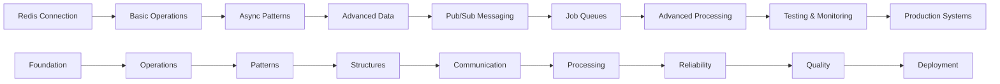

# 0x03. Queuing System in JS

<p align="center">
  
  
  
  
  
</p>

<div align="center">
  <h3>⚡ Master Asynchronous Task Processing</h3>
  <p><em>Build scalable, distributed systems with intelligent job queuing and processing</em></p>
</div>

---

## 📋 Table of Contents
- [🎯 Overview](#-overview)
- [🎓 Learning Objectives](#-learning-objectives)
- [📚 Project Tasks](#-project-tasks)
- [🏗️ Architecture](#️-architecture)
- [💡 Core Competencies](#-core-competencies)
- [🔧 Setup & Prerequisites](#-setup--prerequisites)
- [🚀 Getting Started](#-getting-started)
- [📖 Resources](#-resources)
- [👨‍💻 Author](#-author)

## 🎯 Overview

This project introduces the fundamentals of **queuing systems** and demonstrates how to implement scalable job processing using **Node.js** and **Redis**. You'll build, test, and observe queue operations, job processing, and publish/subscribe patterns essential for modern distributed backend systems.

**Real-world Applications:**
- Background email and notification sending
- Image/video processing pipelines
- Data ETL (Extract, Transform, Load) operations
- Payment processing and financial transactions
- Social media content processing
- Microservice communication and orchestration

**Industry Impact:**
- **Scalability**: Handle millions of jobs efficiently
- **Reliability**: Fault-tolerant task processing
- **Performance**: Non-blocking asynchronous operations
- **Decoupling**: Independent service development and deployment

## 🎓 Learning Objectives

By the end of this project, you will be able to:

### **Core Technical Skills**
- ✅ **Implement Redis-based job queues** for asynchronous task processing
- ✅ **Design pub/sub systems** for real-time event communication
- ✅ **Handle job lifecycle management** including creation, processing, and error handling
- ✅ **Build worker processes** that scale horizontally across multiple instances
- ✅ **Integrate queue monitoring** and job status tracking

### **Professional Development**
- 🎯 **Distributed Systems Design**: Building scalable, loosely-coupled architectures
- 🎯 **Asynchronous Programming**: Mastering event-driven development patterns
- 🎯 **Performance Engineering**: Optimizing throughput and resource utilization
- 🎯 **System Reliability**: Implementing fault tolerance and error recovery

### **Industry Practices**
- 📊 **Message Broker Integration**: Professional queue system implementation
- 📊 **Monitoring & Observability**: Tracking system health and performance
- 📊 **Deployment Strategies**: Scaling workers and managing production queues
- 📊 **Error Handling**: Robust failure management and retry mechanisms

## 📚 Project Tasks

### **Task 0: Redis Client Setup**
**File:** `0-redis_client.js`
- Establish basic Redis connection
- Handle connection events and error states
- Test Redis server connectivity and basic operations

### **Task 1: Node Redis Client**
**File:** `1-redis_op.js`
- Implement synchronous Redis operations
- Set and get string values
- Handle Redis responses and errors

### **Task 2: Node Redis Client with Async/Await**
**File:** `2-redis_op_async.js`
- Convert Redis operations to async/await pattern
- Implement promise-based Redis interactions
- Handle asynchronous operation flows

### **Task 3: Redis Advanced Operations** 
**File:** `4-redis_advanced_op.js`
- Work with Redis hash data structures
- Implement complex data operations
- Handle nested data storage and retrieval

### **Task 4: Publisher/Subscriber Pattern**
**Files:** `5-publisher.js`, `5-subscriber.js`
- Implement Redis pub/sub messaging
- Create real-time event communication
- Handle message broadcasting and subscription

### **Task 5: Basic Job Queue**
**Files:** `6-job_creator.js`, `6-job_processor.js`
- Create and process simple job queues
- Implement job lifecycle management
- Handle basic queue operations

### **Task 6: Advanced Job Processing**
**Files:** `7-job_creator.js`, `7-job_processor.js`
- Implement advanced job creation and processing
- Handle job priorities and queue management
- Add error handling and retry mechanisms

### **Task 7: Job Testing & Monitoring**
**Files:** `8-job.js`, `8-job.test.js`
- Create comprehensive job processing tests
- Implement job status tracking and monitoring
- Handle test scenarios and edge cases

### **Task 8: Real-world Application**
**File:** `9-stock.js`
- Build practical stock management system
- Integrate Express.js with Redis queuing
- Implement reservation and processing workflows

### **Task 9: Advanced Features**
**File:** `100-seat.js`
- Advanced seat reservation system
- Complex business logic with queue integration
- Production-ready error handling and monitoring

### **📊 System Complexity Progression**



## 🏗️ Architecture

### **Queue System Architecture**
```
┌─────────────────┐    ┌─────────────────┐    ┌─────────────────┐
│   Job Creator   │    │   Redis Queue   │    │   Job Worker    │
│   (Producer)    │───▶│   (Message      │───▶│   (Consumer)    │
│                 │    │   Broker)       │    │                 │
└─────────────────┘    └─────────────────┘    └─────────────────┘
         │                       │                       │
         ▼                       ▼                       ▼
┌─────────────────┐    ┌─────────────────┐    ┌─────────────────┐
│   Job Status    │    │   Queue         │    │   Job Result    │
│   Tracking      │    │   Monitoring    │    │   Processing    │
│                 │    │                 │    │                 │
└─────────────────┘    └─────────────────┘    └─────────────────┘
```

### **Pub/Sub Communication Pattern**
```
┌─────────────────┐    ┌─────────────────┐    ┌─────────────────┐
│   Publisher     │    │   Redis         │    │   Subscriber 1  │
│   (Event        │───▶│   Pub/Sub       │───▶│   (Event        │
│   Source)       │    │   Broker        │    │   Handler)      │
└─────────────────┘    └─────────────────┘    └─────────────────┘
                                │                       
                                ▼                       
                       ┌─────────────────┐              
                       │   Subscriber 2  │              
                       │   (Event        │              
                       │   Handler)      │              
                       └─────────────────┘              
```

### **Job Lifecycle Management**
```
[Created] → [Queued] → [Processing] → [Completed]
     │           │           │             │
     ▼           ▼           ▼             ▼
  [Failed]   [Delayed]   [Failed]    [Archived]
     │           │           │             
     ▼           ▼           ▼             
  [Retry]    [Queued]    [Retry]          
```

## 💡 Core Competencies

### 🔧 **Technical Skills**

#### **Asynchronous Programming**
- **Event-Driven Architecture**: Building non-blocking, scalable applications
- **Promise Management**: Effective async/await and Promise.all patterns
- **Callback Handling**: Legacy callback conversion to modern async patterns
- **Error Propagation**: Proper error handling in asynchronous workflows

#### **Redis Mastery**
- **Data Structures**: Strings, hashes, lists, sets, sorted sets
- **Pub/Sub Messaging**: Real-time event communication patterns
- **Queue Implementation**: FIFO, priority, and delayed job queues
- **Connection Management**: Connection pooling and error recovery

#### **Distributed System Design**
- **Message Queuing**: Reliable inter-service communication
- **Worker Scaling**: Horizontal scaling of job processing
- **Load Distribution**: Balancing work across multiple workers
- **Fault Tolerance**: Handling failures and ensuring reliability

### 🎯 **Professional Skills**

#### **System Architecture**
- **Microservice Communication**: Designing loosely-coupled service interactions
- **Scalability Planning**: Building systems that handle increasing load
- **Performance Optimization**: Tuning queue throughput and latency
- **Resource Management**: Efficient use of memory and CPU resources

#### **DevOps & Production**
- **Monitoring & Logging**: Tracking queue health and job performance
- **Deployment Strategies**: Rolling updates and blue-green deployments
- **Error Recovery**: Implementing retry logic and dead letter queues
- **Capacity Planning**: Sizing infrastructure for expected workloads

#### **Software Engineering**
- **Testing Strategies**: Unit testing, integration testing for queue systems
- **Code Quality**: Clean, maintainable asynchronous code
- **Documentation**: Comprehensive API and system documentation
- **Version Control**: Managing distributed system deployments

## 🔧 Setup & Prerequisites

### **System Requirements**
- **Node.js**: 14+ (recommended: 16+ for optimal performance)
- **Redis**: 6.0+ server (local or remote instance)
- **npm**: Latest version for package management
- **Terminal**: For running multiple processes simultaneously

### **Installation**

#### **Node.js and npm Setup**
```bash
# Verify Node.js installation
node --version  # Should be v14+
npm --version

# Update npm to latest version
npm install -g npm@latest
```

#### **Redis Installation**

**macOS (using Homebrew):**
```bash
brew install redis
brew services start redis
```

**Ubuntu/Debian:**
```bash
sudo apt update
sudo apt install redis-server
sudo systemctl start redis-server
sudo systemctl enable redis-server
```

**Windows (using WSL or Docker):**
```bash
# Using Docker
docker run -d -p 6379:6379 --name redis-server redis:alpine

# Or using WSL with Ubuntu setup above
```

#### **Project Dependencies**
```bash
# Navigate to project directory
cd 0x03-queuing_system_in_js

# Install project dependencies
npm install

# Verify Redis connection
redis-cli ping  # Should return "PONG"
```

### **Development Environment Setup**
```bash
# Install global development tools
npm install -g nodemon      # For auto-restarting during development
npm install -g concurrently # For running multiple processes

# Install testing and quality tools
npm install --save-dev mocha chai sinon
npm install --save-dev eslint eslint-config-standard
```

### **Package.json Dependencies**
Key dependencies included in the project:
- **redis**: Redis client for Node.js
- **kue**: Job queue library built on Redis
- **express**: Web framework for API endpoints
- **babel**: JavaScript compiler for modern syntax
- **mocha**: Testing framework
- **chai**: Assertion library

### **VS Code Extensions (Recommended)**
- **JavaScript (ES6) code snippets**: Enhanced JavaScript support
- **Redis**: Redis syntax highlighting and commands
- **REST Client**: Testing API endpoints
- **ESLint**: Code quality and linting
- **Node.js Modules Intellisense**: Better import suggestions

## 🚀 Getting Started

### **Quick Start Guide**

1. **Verify Redis Server**
   ```bash
   # Start Redis server (if not running)
   redis-server
   
   # Test Redis connection
   redis-cli ping
   # Expected output: PONG
   
   # Check Redis info
   redis-cli info server
   ```

2. **Test Basic Redis Connection**
   ```bash
   # Run basic Redis client test
   node 0-redis_client.js
   
   # Expected output:
   # Redis client connected to the server
   # Redis client disconnected from the server
   ```

3. **Explore Redis Operations**
   ```bash
   # Test synchronous operations
   node 1-redis_op.js
   
   # Test asynchronous operations
   node 2-redis_op_async.js
   
   # Test advanced hash operations
   node 4-redis_advanced_op.js
   ```

4. **Experiment with Pub/Sub**
   ```bash
   # Terminal 1: Start subscriber
   node 5-subscriber.js
   
   # Terminal 2: Start publisher
   node 5-publisher.js
   
   # Observe real-time message passing
   ```

5. **Create and Process Jobs**
   ```bash
   # Terminal 1: Start job processor
   node 6-job_processor.js
   
   # Terminal 2: Create jobs
   node 6-job_creator.js
   
   # Watch jobs being processed in real-time
   ```

6. **Run Advanced Examples**
   ```bash
   # Test stock management system
   node 9-stock.js
   
   # In another terminal, test the API
   curl http://localhost:1245/list_products
   curl http://localhost:1245/reserve_product/1
   ```

### **Development Workflow**

1. **🔧 Setup**: Start Redis server and verify connection
2. **📝 Develop**: Write queue producers and consumers
3. **🧪 Test**: Run unit tests and integration tests
4. **🔍 Monitor**: Observe job processing and queue health
5. **⚡ Scale**: Add multiple worker processes
6. **🚀 Deploy**: Deploy to production with monitoring

### **Testing Strategy**
```bash
# Run all tests
npm test

# Run specific test file
npm test test/8-job.test.js

# Run tests with coverage
npm run test:coverage

# Run linting
npm run lint

# Fix linting issues
npm run lint:fix
```

### **Monitoring and Debugging**
```bash
# Monitor Redis activity
redis-cli monitor

# Check queue statistics
redis-cli
> INFO memory
> INFO stats
> KEYS *

# Monitor job processing
node -e "
const redis = require('redis');
const client = redis.createClient();
setInterval(() => {
  client.llen('job_queue', (err, length) => {
    console.log(\`Queue length: \${length}\`);
  });
}, 1000);
"
```

### **Production Considerations**
```bash
# Environment variables for production
export REDIS_HOST=your-redis-host
export REDIS_PORT=6379
export REDIS_PASSWORD=your-password

# Start with process manager
pm2 start 6-job_processor.js --instances 4
pm2 start 9-stock.js --name stock-api

# Monitor with PM2
pm2 monit
pm2 logs
```

## 📖 Resources

### **Official Documentation**
- [Node.js Documentation](https://nodejs.org/en/docs/) - Node.js runtime and APIs
- [Redis Documentation](https://redis.io/documentation) - Redis commands and features
- [Kue Documentation](https://github.com/Automattic/kue) - Job queue library
- [Express.js Guide](https://expressjs.com/en/guide/) - Web framework documentation

### **Queue System Concepts**
- [Message Queue Patterns](https://www.enterpriseintegrationpatterns.com/patterns/messaging/) - Enterprise integration patterns
- [Pub/Sub Messaging](https://aws.amazon.com/pub-sub-messaging/) - Publisher-subscriber patterns
- [Job Queue Design](https://blog.iron.io/top-10-job-queue-articles/) - Queue system design principles
- [Distributed Systems](https://martinfowler.com/articles/patterns-of-distributed-systems/) - Distributed architecture patterns

### **Redis Deep Dive**
- [Redis Data Types](https://redis.io/topics/data-types) - Core Redis data structures
- [Redis Pub/Sub](https://redis.io/topics/pubsub) - Messaging implementation
- [Redis Persistence](https://redis.io/topics/persistence) - Data durability options
- [Redis Scaling](https://redis.io/topics/partitioning) - Horizontal scaling strategies

### **Node.js Asynchronous Programming**
- [Async/Await Guide](https://developer.mozilla.org/en-US/docs/Learn/JavaScript/Asynchronous/Async_await) - Modern async patterns
- [Event Loop](https://nodejs.org/en/docs/guides/event-loop-timers-and-nexttick/) - Understanding Node.js concurrency
- [Streams](https://nodejs.org/api/stream.html) - Node.js streaming APIs
- [Worker Threads](https://nodejs.org/api/worker_threads.html) - CPU-intensive task handling

### **Industry Best Practices**
- [Microservices Patterns](https://microservices.io/patterns/data/saga.html) - Service communication patterns
- [Circuit Breaker](https://martinfowler.com/bliki/CircuitBreaker.html) - Fault tolerance patterns
- [Retry Strategies](https://aws.amazon.com/builders-library/timeouts-retries-and-backoff-with-jitter/) - Error recovery patterns
- [Monitoring](https://sre.google/sre-book/monitoring-distributed-systems/) - System observability

### **Production Queue Systems**
- [Apache Kafka](https://kafka.apache.org/documentation/) - Distributed streaming platform
- [RabbitMQ](https://www.rabbitmq.com/getstarted.html) - Message broker
- [Amazon SQS](https://aws.amazon.com/sqs/) - Managed message queuing
- [Google Cloud Tasks](https://cloud.google.com/tasks/docs) - Asynchronous task execution

### **Performance and Scaling**
- [Load Testing](https://k6.io/docs/) - Performance testing tools
- [Horizontal Scaling](https://12factor.net/concurrency) - Scaling strategies
- [Caching Strategies](https://redis.io/topics/lru-cache) - Performance optimization
- [Database Scaling](https://aws.amazon.com/database/) - Data layer scaling

### **Testing and Quality**
- [Mocha Testing](https://mochajs.org/) - JavaScript testing framework
- [Chai Assertions](https://www.chaijs.com/) - Assertion library
- [Sinon Mocking](https://sinonjs.org/) - Test doubles for JavaScript
- [Integration Testing](https://martinfowler.com/articles/practical-test-pyramid.html) - Testing strategies

### **DevOps and Deployment**
- [Docker Containers](https://docs.docker.com/get-started/) - Containerization
- [PM2 Process Manager](https://pm2.keymetrics.io/docs/) - Node.js process management
- [Kubernetes](https://kubernetes.io/docs/concepts/) - Container orchestration
- [Monitoring Tools](https://prometheus.io/docs/introduction/overview/) - System monitoring

### **Project Context**
- 📚 Main repository: [ALX Backend Engineering](../README.md)
- 🌍 Previous project: [Internationalization](../0x02-i18n/README.md)
- 🔄 Related concepts: Distributed systems, asynchronous programming, performance optimization

## 👨‍💻 Author

**ALX Backend Engineering Track**  
*Building scalable, distributed systems with intelligent task processing*

## 📄 License

This project is part of the **ALX Software Engineering curriculum**.  
Educational use only - please respect academic integrity policies.
