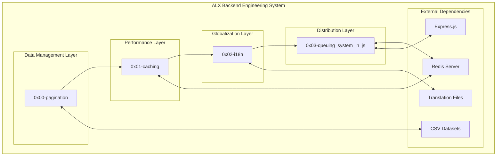
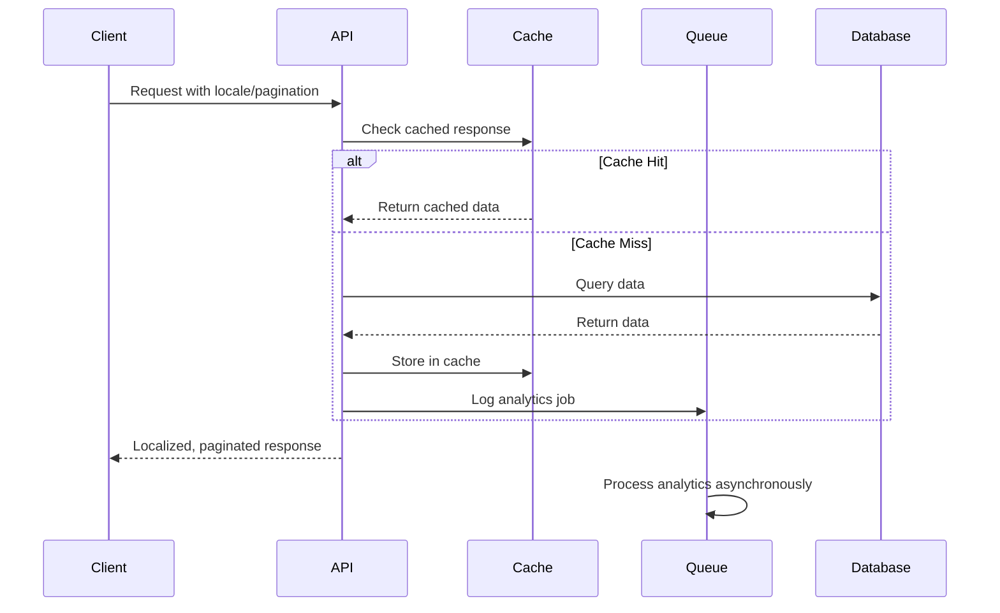

# Architecture Overview - ALX Backend Engineering

## 1. Project Overview

**Purpose**: The `alx-backend` container project provides comprehensive education in backend engineering fundamentals through hands-on implementation of core concepts including pagination, caching, internationalization, and distributed task processing.

**Scope**: Four interconnected projects covering data management optimization, performance engineering, global application development, and asynchronous system design. Each project builds upon previous concepts while introducing new technical challenges.

**Key Features**:
- Efficient data pagination with hypermedia API design
- High-performance caching with multiple replacement algorithms
- Complete internationalization and localization framework
- Distributed job queuing and asynchronous task processing

## 2. System Architecture

### Architecture Diagram


**Description**: The system follows a **layered educational architecture** where each project represents a distinct layer of backend engineering competency. Projects are designed to be independent yet demonstrate how different backend concepts integrate in real-world applications.

## 3. Component Details

### 0x00-pagination (Data Management Component)
- **Purpose**: Efficient data retrieval and navigation for large datasets
- **Key Technologies**: Python, Flask, CSV processing
- **Responsibilities**: 
  - Index calculation and boundary management
  - RESTful pagination endpoint design
  - Hypermedia API implementation (HATEOAS)
  - Edge case handling and validation
- **Interactions**: Provides foundation for all subsequent data-heavy operations

### 0x01-caching (Performance Component)
- **Purpose**: Memory optimization and response time improvement
- **Key Technologies**: Python, Object-Oriented Programming, Algorithm Design
- **Responsibilities**:
  - Cache replacement algorithm implementation (FIFO, LIFO, LRU, MRU, LFU)
  - Memory management and optimization
  - Performance measurement and comparison
  - Extensible cache architecture design
- **Interactions**: Can be integrated with pagination for enhanced performance

### 0x02-i18n (Globalization Component)
- **Purpose**: International user accessibility and cultural adaptation
- **Key Technologies**: Python, Flask, Babel, Jinja2, gettext
- **Responsibilities**:
  - Multi-language content management
  - Locale detection and switching
  - Cultural formatting (dates, numbers, currency)
  - Translation workflow automation
- **Interactions**: Provides globalization layer for any web-based components

### 0x03-queuing_system_in_js (Distribution Component)
- **Purpose**: Asynchronous task processing and distributed system communication
- **Key Technologies**: Node.js, Redis, Express.js, Pub/Sub patterns
- **Responsibilities**:
  - Job queue creation and management
  - Worker process scaling and load distribution
  - Real-time event communication (pub/sub)
  - Fault tolerance and error recovery
- **Interactions**: Can process jobs from any other component asynchronously

## 4. Data Models / Schema

### Pagination Data Models
```python
PageResponse = {
    "data": List[Any],           # Current page items
    "page": int,                 # Current page number  
    "page_size": int,            # Items per page
    "total_pages": int,          # Total available pages
    "next_url": Optional[str],   # Next page navigation
    "prev_url": Optional[str]    # Previous page navigation
}
```

### Cache Data Models
```python
CacheEntry = {
    "key": str,                  # Cache key identifier
    "value": Any,                # Cached data
    "access_time": datetime,     # Last access timestamp
    "access_count": int,         # Frequency counter
    "insertion_time": datetime   # Cache insertion time
}
```

### i18n Data Models
```python
LocaleContext = {
    "locale": str,               # Language code (en, fr, es)
    "timezone": str,             # User timezone
    "user_preference": bool,     # User-selected locale
    "detected_locale": str       # Auto-detected from headers
}
```

### Queue Data Models
```javascript
JobDefinition = {
    id: string,                  // Unique job identifier
    type: string,                // Job type/category
    data: object,                // Job payload
    priority: number,            // Processing priority
    attempts: number,            // Retry attempts
    status: 'pending'|'processing'|'completed'|'failed'
}
```

## 5. Data Flow

### Overall System Data Flow


### Component-Specific Flows

**Pagination Flow**:
1. Client requests page with size parameters
2. System validates parameters and calculates indices
3. Data subset retrieved and formatted
4. Hypermedia links generated for navigation
5. Response delivered with metadata

**Caching Flow**:
1. Cache lookup performed for requested key
2. If hit: return cached value, update access metadata
3. If miss: compute value, apply eviction policy if needed
4. Store new value and return to client

**i18n Flow**:
1. Detect user locale from URL/headers/preferences
2. Load appropriate translation catalog
3. Translate all marked strings using gettext
4. Format dates/numbers according to locale
5. Render localized response

**Queue Flow**:
1. Producer creates job with payload and priority
2. Job added to Redis queue with metadata
3. Worker processes monitor queue for new jobs
4. Job retrieved, processed, and status updated
5. Results stored and notifications sent

## 6. Deployment & Environment

### Development Environment
```bash
# Python projects (pagination, caching, i18n)
python3 -m venv venv
source venv/bin/activate
pip install -r requirements.txt

# Node.js project (queuing)
cd 0x03-queuing_system_in_js
npm install
```

### Production Deployment
```bash
# Redis server setup
redis-server --daemonize yes

# Python applications
gunicorn app:app --workers 4

# Node.js applications  
pm2 start app.js --instances 4
```

### Key Configuration
- **Python**: Virtual environments, Flask configuration
- **Node.js**: Process management with PM2
- **Redis**: Memory optimization, persistence settings
- **Nginx**: Reverse proxy, load balancing (production)

## 7. Security Considerations

### Authentication/Authorization
- **API Access**: Rate limiting on pagination endpoints
- **Cache Security**: Memory isolation between cache instances  
- **i18n Security**: Input validation for locale parameters
- **Queue Security**: Job payload validation and sanitization

### Data Protection
- **Sensitive Data**: No sensitive information in cache or logs
- **Input Validation**: Comprehensive parameter validation across all endpoints
- **Error Handling**: Secure error messages without system information exposure

## 8. Error Handling & Resilience

### Error Handling Strategy
- **Pagination**: Graceful handling of out-of-range pages and invalid parameters
- **Caching**: Fallback to source data on cache failures
- **i18n**: Default locale fallback for unsupported languages
- **Queuing**: Retry mechanisms with exponential backoff

### Resilience Patterns
- **Circuit Breaker**: Prevent cascade failures in queue processing
- **Graceful Degradation**: System continues with reduced functionality
- **Health Checks**: Monitor component availability and performance
- **Rollback Capability**: Safe deployment rollback procedures

## 9. Design Decisions & Trade-offs

### Key Decisions
- **Modular Architecture**: Enables focused learning and independent development
- **Multiple Languages**: Python for web/data, JavaScript for async processing
- **Redis Choice**: Excellent performance for both caching and queuing use cases
- **Educational Focus**: Prioritizes learning objectives over production optimization

### Alternatives Considered
- **Monolithic Design**: Rejected due to learning complexity and maintainability
- **Single Language**: Rejected to demonstrate polyglot programming skills
- **Database Caching**: Redis chosen for simplicity and performance
- **Cloud Queuing**: Local Redis chosen for educational control and cost

### Limitations
- **Scalability**: Designed for learning, not production-scale traffic
- **Production Features**: Missing monitoring, logging, and advanced security
- **Data Persistence**: Limited backup and recovery mechanisms
- **High Availability**: Single points of failure in educational setup

## 10. Glossary

### Terms & Acronyms
- **HATEOAS**: Hypermedia as the Engine of Application State
- **i18n**: Internationalization (18 letters between 'i' and 'n')
- **l10n**: Localization (10 letters between 'l' and 'n')
- **FIFO**: First In, First Out (cache replacement policy)
- **LRU**: Least Recently Used (cache replacement policy)
- **Pub/Sub**: Publisher/Subscriber messaging pattern
- **gettext**: GNU internationalization and localization system
- **Redis**: Remote Dictionary Server (in-memory data structure store)

## 11. Further Reading & References

### Documentation Links
- [Flask Documentation](https://flask.palletsprojects.com/) - Web framework
- [Redis Documentation](https://redis.io/documentation) - In-memory database
- [Babel Documentation](http://babel.pocoo.org/) - Internationalization library
- [Node.js Documentation](https://nodejs.org/en/docs/) - JavaScript runtime

### Standards & Best Practices
- [REST API Design Guidelines](https://restfulapi.net/)
- [HTTP Status Code Standards](https://httpstatuses.com/)
- [Unicode Internationalization Guidelines](https://unicode.org/standard/)
- [Message Queue Patterns](https://www.enterpriseintegrationpatterns.com/)

### Related ALX Projects
- [System Engineering DevOps](../alx-system_engineering-devops/) - Infrastructure setup
- [Higher Level Programming](../alx-higher_level_programming/) - Python foundations
- [Backend JavaScript](../alx-backend-javascript/) - Advanced JavaScript concepts

## Main System Components

- **API Layer / Controller:** Handles incoming requests, validates input, and routes to the appropriate logic. (Flask APIs, Node.js endpoints)
- **Processing Layer:** Applies business logic such as pagination, caching, internationalization, or queueing.
- **Data Layer:** Interacts with data sources (CSV, JSON, Redis, etc.) and returns results.
- **Response Layer:** Formats and returns the response to the client or next system.

### Subproject Roles

- **0x00-pagination:** Implements efficient pagination algorithms and helper functions for slicing, page navigation, and metadata generation.
- **0x01-caching:** Demonstrates multiple caching strategies (FIFO, LRU, LFU, MRU) for performance optimization and resource management.
- **0x02-i18n:** Adds internationalization (i18n) support using Flask and Babel, handling locale selection, translation files, and dynamic content adaptation.
- **0x03-queuing_system_in_js:** Implements asynchronous job queueing and processing using Node.js and Redis, demonstrating event-driven programming and background task management.

## Design Principles
- **Separation of Concerns:** Each subproject addresses a single backend topic.
- **Reusability:** Helper modules and patterns are designed for reuse across projects.
- **Scalability:** The structure supports easy addition of new backend modules.
- **Documentation:** Each module includes its own README and usage instructions.

## Technology Integration
- **Python/Flask:** Used for API endpoints, i18n, and backend logic.
- **Node.js/Redis:** Used for queueing and asynchronous job processing.
- **Babel:** Manages translations and locale files.
- **Testing:** Each module includes tests (unittest, custom scripts) for validation.

## Extensibility
- New backend topics can be added as new subdirectories, following the established pattern.
- Shared utilities and patterns can be promoted to the container level if needed.

---

For detailed architecture and implementation specifics, see the `ARCHITECTURE.md` in each nested project directory.
